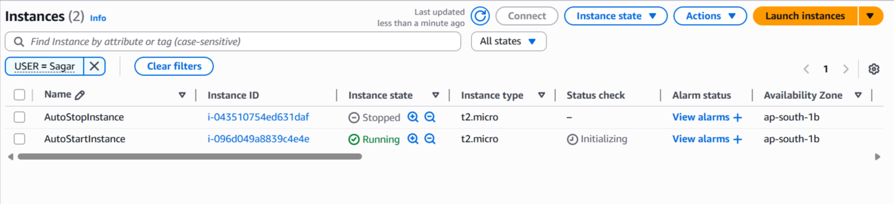

### 🚀 **Assignment 1: Automated Instance Management Using AWS Lambda and Boto3**

---

#### 🖥️ **Step 1: Launch and Tag EC2 Instances**

##### 1.1 🔐 Log in to AWS Console

Go to [AWS Console](https://console.aws.amazon.com/).

##### 1.2 💡 Launch Two EC2 Instances

1. **Navigate:** 🔎 Search for and select **EC2** from the AWS services.
2. **Launch Instance:** 🟢 Click **Instances** in the left sidebar, then click the **Launch Instances** button.
3. **Instance details:**

   * 🏷️ Name: `AutoStopInstance` (for first instance)
   * 💻 AMI: Choose Amazon Linux 2 (or any free-tier OS)
   * 🪙 Instance type: `t2.micro` (free tier)
   * 🗝️ Key pair: Select/Create as needed
   * 🌐 Network settings: Default is fine for demo
4. **Add tag for first instance:**

   * Scroll down to the **Tags** section.
   * ➕ Click **Add tag**.

     * **Key:** `Action`
     *  **Value:** `Auto-Stop`
   * ➕ Click **Add tag**.

     * **Key:** `USER`
     *  **Value:** `Sagar`
5. **Repeat** to launch a second instance:

   * 🏷️ Name: `AutoStartInstance`
   * **Tag:**

     * **Key:** `Action`
     * **Value:** `Auto-Start`
   * ➕ Click **Add tag**.

     * **Key:** `USER`
     *  **Value:** `Sagar`
6. 🚀 **Launch Instances** and wait for both to be in **running** state.

---

#### 🔐 **Step 2: Create IAM Role for Lambda**

##### 2.1 🧑‍💻 Go to IAM

1. In AWS Console, 🔎 search and select **IAM**.
2. Click **Roles** > **Create Role**.

##### 2.2 🛡️ Create Role

1. **Trusted entity:** Choose **AWS service**
2. **Use Case:** Select **Lambda**.
3. **Next: Permissions**

##### 2.3 📜 Attach Permissions

1. **Policy:** Search for and select `AmazonEC2FullAccess`.
   *(For production: use custom least-privilege policy.)*
2. Click **Next**
3. 📝 **Role Name:** Example: `SagarLambdaEC2ManagementRole`
4. ✅ Click **Create Role**

---

#### ⚡ **Step 3: Create Lambda Function**

##### 3.1 🏃‍♂️ Go to Lambda Console

1. In AWS Console, 🔎 search for and select **Lambda**.
2. Click **Create function**

##### 3.2 ⚙️ Configure Function

1. **Author from scratch**

   * 📝 Name: `EC2AutoStartStop`
   * 🐍 Runtime: **Python 3.12**
2. **Change default execution role:**

   * Select **Use an existing role**
   * Choose the `SagarLambdaEC2ManagementRole` you just created
3. ✅ Click **Create function**

---

#### 💻 **Step 4: Add Lambda Code**

##### 4.1 ✏️ Open Function Editor

* Scroll down to the **Code source** section.

##### 4.2 📝 Paste the Code

Delete any default code and paste the following:

```python
import boto3

def lambda_handler(event, context):
    # Create an EC2 client
    ec2 = boto3.client('ec2')

    # Find instances with tag Action=Auto-Stop
    stop_response = ec2.describe_instances(
        Filters=[
            {'Name': 'tag:Action', 'Values': ['Auto-Stop']},
            {'Name': 'tag:USER', 'Values': ['Sagar']},
            {'Name': 'instance-state-name', 'Values': ['running']}
        ]
    )

    instances_to_stop = [
        instance['InstanceId']
        for reservation in stop_response['Reservations']
        for instance in reservation['Instances']
    ]

    # Find instances with tag Action=Auto-Start
    start_response = ec2.describe_instances(
        Filters=[
            {'Name': 'tag:Action', 'Values': ['Auto-Start']},
            {'Name': 'tag:USER', 'Values': ['Sagar']},
            {'Name': 'instance-state-name', 'Values': ['stopped']}
        ]
    )

    instances_to_start = [
        instance['InstanceId']
        for reservation in start_response['Reservations']
        for instance in reservation['Instances']
    ]

    # Stop instances
    if instances_to_stop:
        print(f"Stopping: {instances_to_stop}")
        ec2.stop_instances(InstanceIds=instances_to_stop)
    else:
        print("No instances to stop.")

    # Start instances
    if instances_to_start:
        print(f"Starting: {instances_to_start}")
        ec2.start_instances(InstanceIds=instances_to_start)
    else:
        print("No instances to start.")

    # Print the results
    return {
        'StoppedInstances': instances_to_stop,
        'StartedInstances': instances_to_start
    }
```

##### 4.3 🚀 **Click Deploy**

---

#### 🧪 **Step 5: Test Your Lambda Function**

##### 5.1 🟢 Prepare Test State

* Ensure your "Auto-Stop" instance is **running** and "Auto-Start" is **stopped** for visible effect.

##### 5.2 🧑‍🔬 Test in Lambda Console

1. In your Lambda function page, click **Test**.
2. For the first time, it asks to "Configure test event":

   * 📝 **Event name:** (give any name)
   * Leave the event JSON as `{}` (empty event)
   * Click **Save**
3. 🟢 Click **Test** (again) to **run** the function.

##### 5.3 🔍 Check the Output

* Scroll down to **Execution results**: You should see the list of instance IDs started/stopped.
* Go to **EC2 dashboard** and confirm:

  * Instance with tag `Auto-Stop` is **stopping**
  * Instance with tag `Auto-Start` is **starting**

##### 5.4 📄 View Logs (Optional)

* Go to **Monitor > View logs in CloudWatch** to see Lambda’s print output.