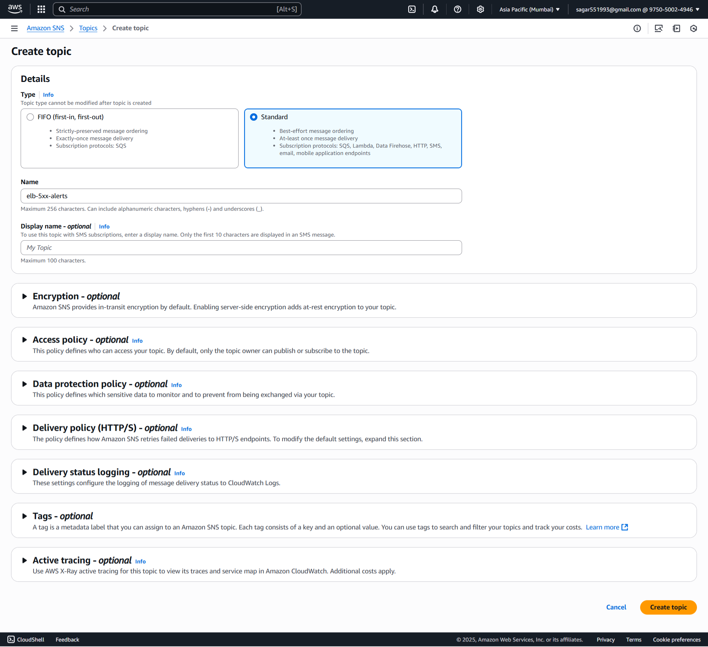
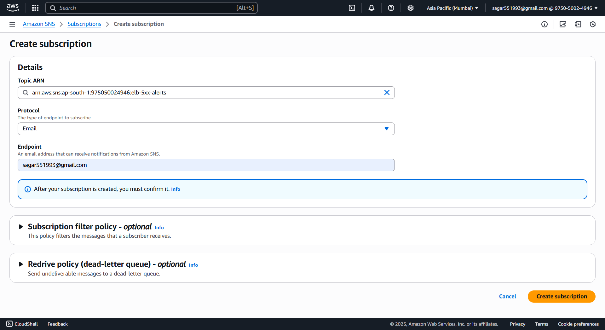
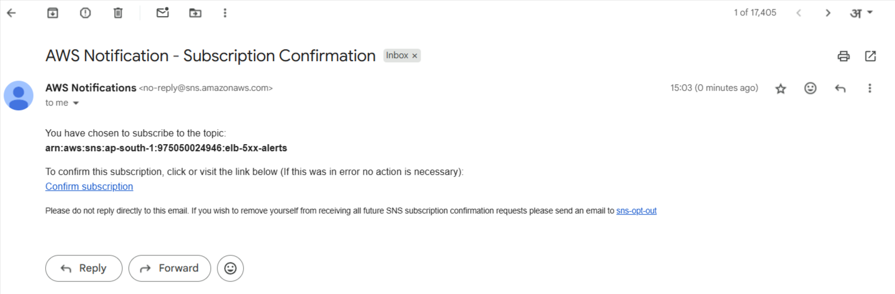
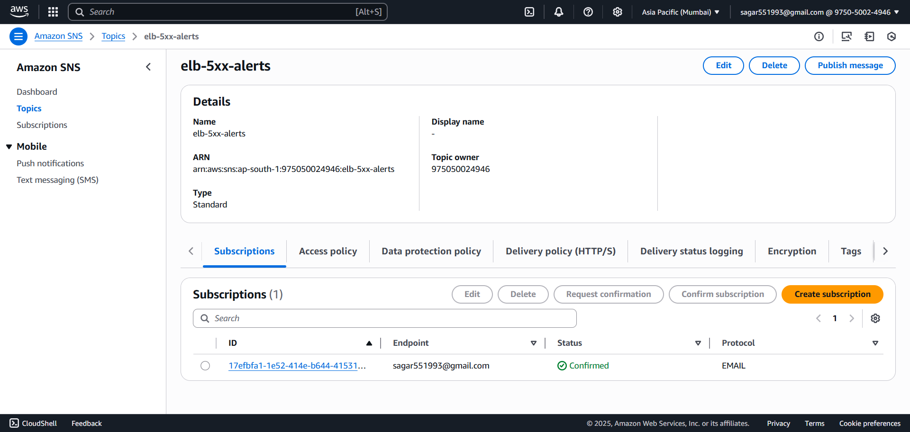
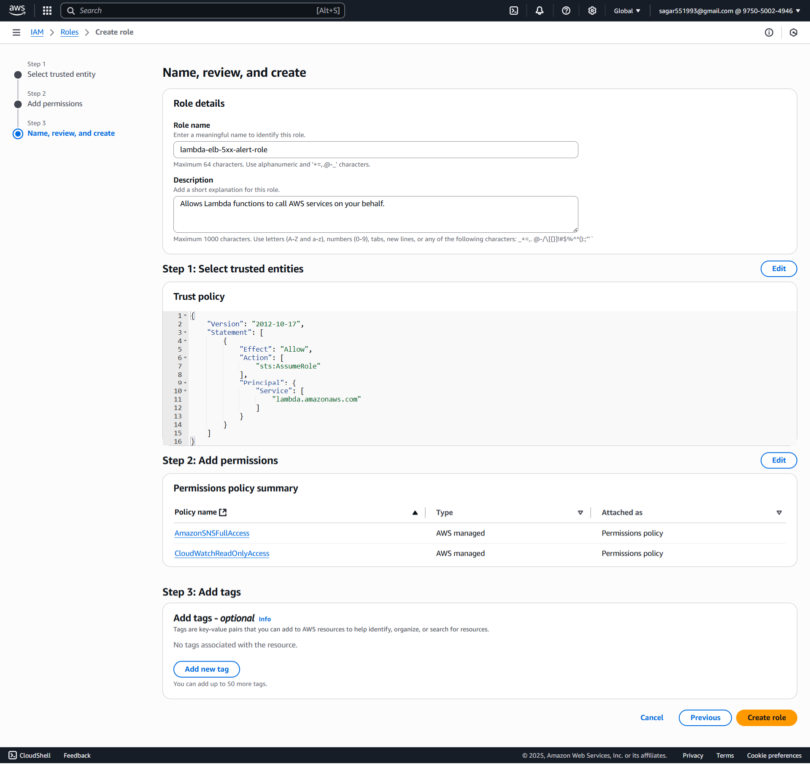
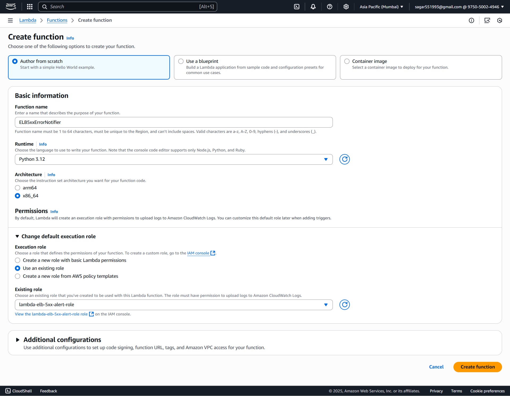
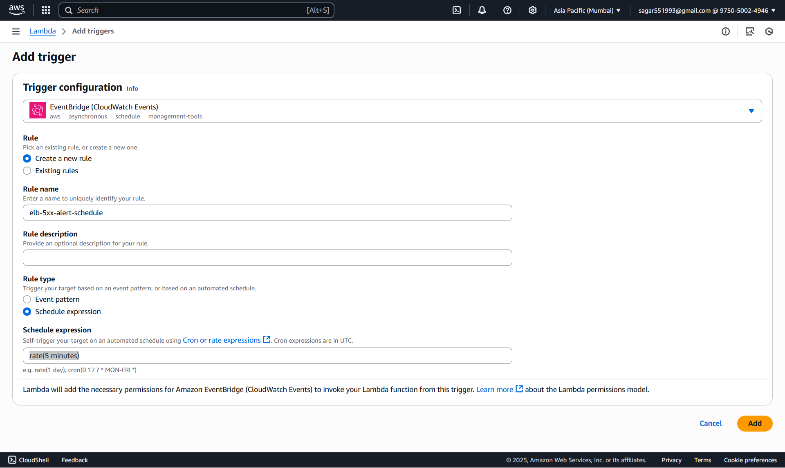
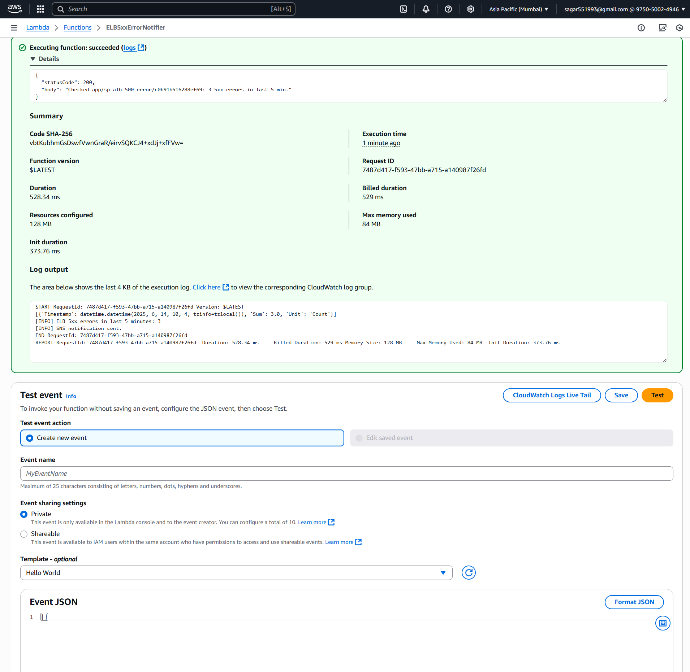
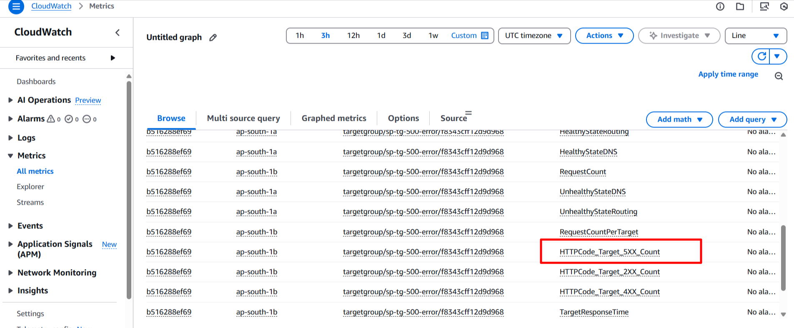
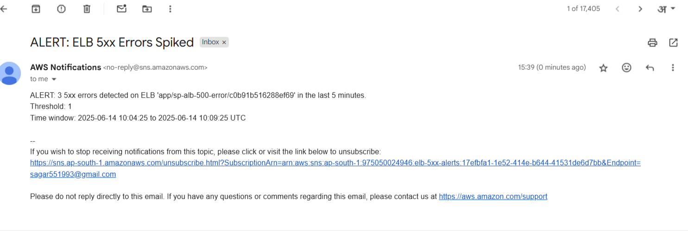

### 🚀 **Assignment 10: Notify When ELB 5xx Errors Spike Using AWS Lambda, Boto3, and SNS**

#### ✅ Step 1. SNS Setup

##### 📌 1.1. Create an SNS Topic

1. Go to **AWS Management Console** → **SNS** → **Topics**.
2. Click **➕ Create topic**.
3. **Type**: `Standard`
4. **Name**: `elb-5xx-alerts`
5. Click **Create topic**


##### 📧 1.2. Subscribe Your Email

1. Select your newly created topic.
2. Click **Create subscription**.
3. **Protocol**: `Email`
4. **Endpoint**: *Your email address*
5. 📩 Check your email inbox and **confirm the subscription** by clicking the link.




#### **🔐 Step 2: Create Lambda IAM Role**

##### 🔑 **2.1 Create an IAM Role**

1. Navigate to the [AWS IAM Console](https://console.aws.amazon.com/iam/).
2. Click **Roles > Create role**.
3. Select **AWS service** and choose **Lambda**.
4. Click **Next**.

#### 🛡️ **2.2 Attach Permissions**

1. Permissions policies.
    - CloudWatchReadOnlyAccess
    - AmazonSNSFullAccess
2. Click **Next**.

#### 📝 **2.3 Finalize Role Creation**

1. Name the role, e.g., `lambda-elb-5xx-alert-role`.
2. Click **Create role**.


#### ⚡ **Step 3: Create Lambda Function**

##### 3.1 🏃‍♂️ Go to Lambda Console

1. In AWS Console, 🔎 search for and select **Lambda**.
2. Click **Create function**

##### 3.2 ⚙️ Configure Function

1. **Author from scratch**

   * 📝 Name: `ELB5xxErrorNotifier`
   * 🐍 Runtime: **Python 3.12**
2. **Change default execution role:**

   * Select **Use an existing role**
   * Choose the `lambda-elb-5xx-alert-role` you just created
3. ✅ Click **Create function**


##### 3.3 Lambda Python Script

For best practice, set this as an **environment variable** in the Lambda console.

```python
import boto3
import os
from datetime import datetime, timedelta, timezone

# ENV VARS
ELB_NAME = os.environ['ELB_NAME']           # e.g., 'app/my-app/0123456789abcdef'
SNS_TOPIC_ARN = os.environ['SNS_TOPIC_ARN']
THRESHOLD = int(os.environ.get('THRESHOLD', 10))

cloudwatch = boto3.client('cloudwatch')
sns = boto3.client('sns')

def lambda_handler(event, context):
    # Time window: last 5 minutes
    end_time = datetime.now(timezone.utc)
    start_time = end_time - timedelta(minutes=5)

    # Query ELB 5XX count (ELB or ALB: adjust accordingly)
    metric_dimensions = [
        {'Name': 'LoadBalancer', 'Value': ELB_NAME}
    ]

    # For ALB: Use 'HTTPCode_Target_5XX_Count'
    response = cloudwatch.get_metric_statistics(
        Namespace='AWS/ApplicationELB',
        MetricName='HTTPCode_ELB_5XX_Count',
        Dimensions=metric_dimensions,
        StartTime=start_time,
        EndTime=end_time,
        Period=300,
        Statistics=['Sum'],
    )

    datapoints = response['Datapoints']
    error_count = int(datapoints[0]['Sum']) if datapoints else 0

    print(f"[INFO] ELB 5xx errors in last 5 minutes: {error_count}")

    if error_count > THRESHOLD:
        message = (
            f"ALERT: {error_count} 5xx errors detected on ELB '{ELB_NAME}' in the last 5 minutes.\n"
            f"Threshold: {THRESHOLD}\n"
            f"Time window: {start_time.strftime('%Y-%m-%d %H:%M:%S')} to {end_time.strftime('%Y-%m-%d %H:%M:%S')} UTC"
        )
        sns.publish(
            TopicArn=SNS_TOPIC_ARN,
            Subject="ALERT: ELB 5xx Errors Spiked",
            Message=message,
        )
        print("[INFO] SNS notification sent.")
    else:
        print("[INFO] No alert triggered.")

    return {
        "statusCode": 200,
        "body": f"Checked {ELB_NAME}: {error_count} 5xx errors in last 5 min."
    }
```

Click **Deploy**.

##### 🛠️ **3.4 Configure Environment Variables**

1. Click on the **Configuration** tab in Lambda.
2. Go to **Environment variables** and add:
   * `ELB_NAME`: e.g., `app/my-app/0123456789abcdef`
   * `SNS_TOPIC_ARN`: e.g., `arn:aws-xxxxx`
   * `THRESHOLD`: e.g., `10`
3. Click **Save**.

#### **⏰ Step 4 Schedule Lambda with CloudWatch Events**

1. Go to your Lambda function.
2. Click **Add trigger** > **EventBridge (CloudWatch Events)**.
3. Name: `elb-5xx-alert-schedule`
3. Set the schedule expression (e.g., `rate(1 minutes)`).
4. Click **Add**.


#### **🧪 Step 5: Manual Test & Automation & Validation**
##### 5.1 🧑‍🔬 Test in Lambda Console

1. In your Lambda function page, click **Test**.
2. For the first time, it asks to "Configure test event":

   * 📝 **Event name:** (`test-alb-5xx-alert`)
   - Leave the event JSON as `{}` (empty event)
   * Click **Save**
3. 🟢 Click **Test** (again) to **run** the function.
4. Check your email for the SNS alert.



##### 5.2 Automation
- Every 5 minutes, you will automatically receive an email with your subscription details.

##### 5.3 🔍 Validation


