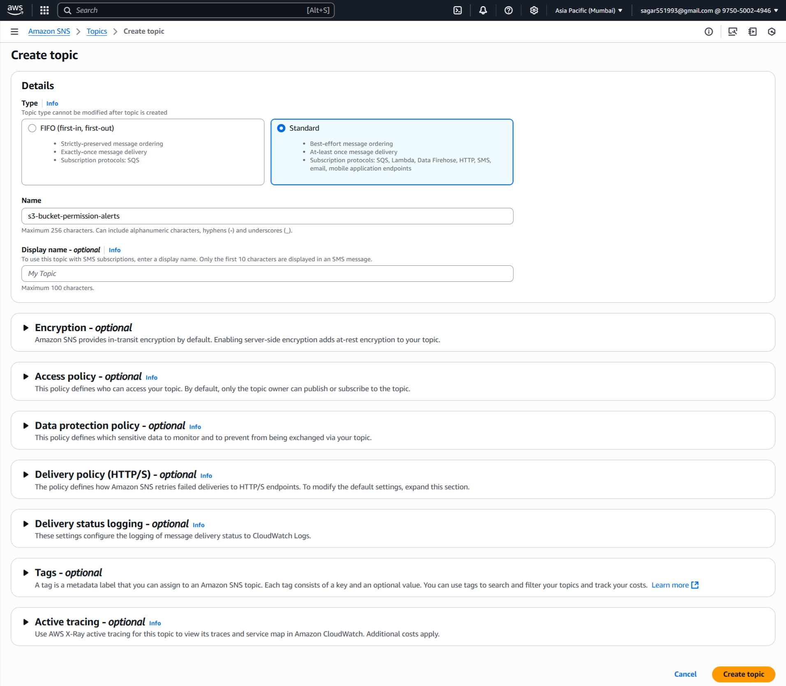
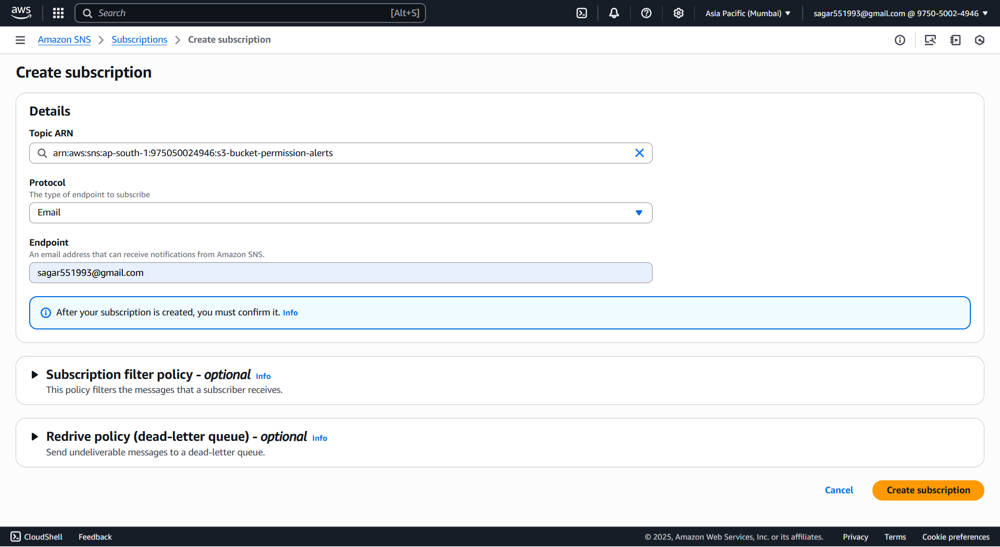
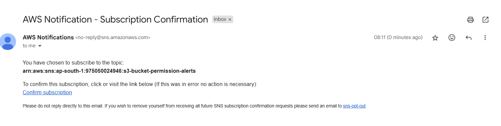
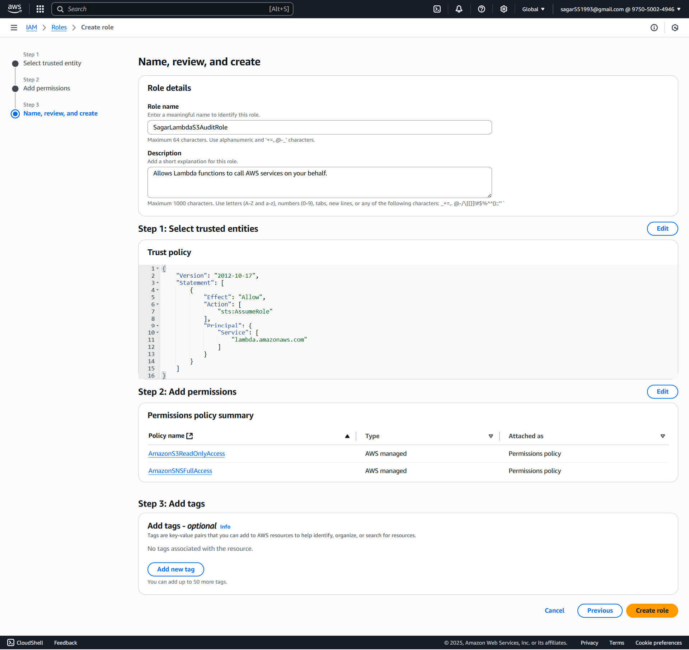
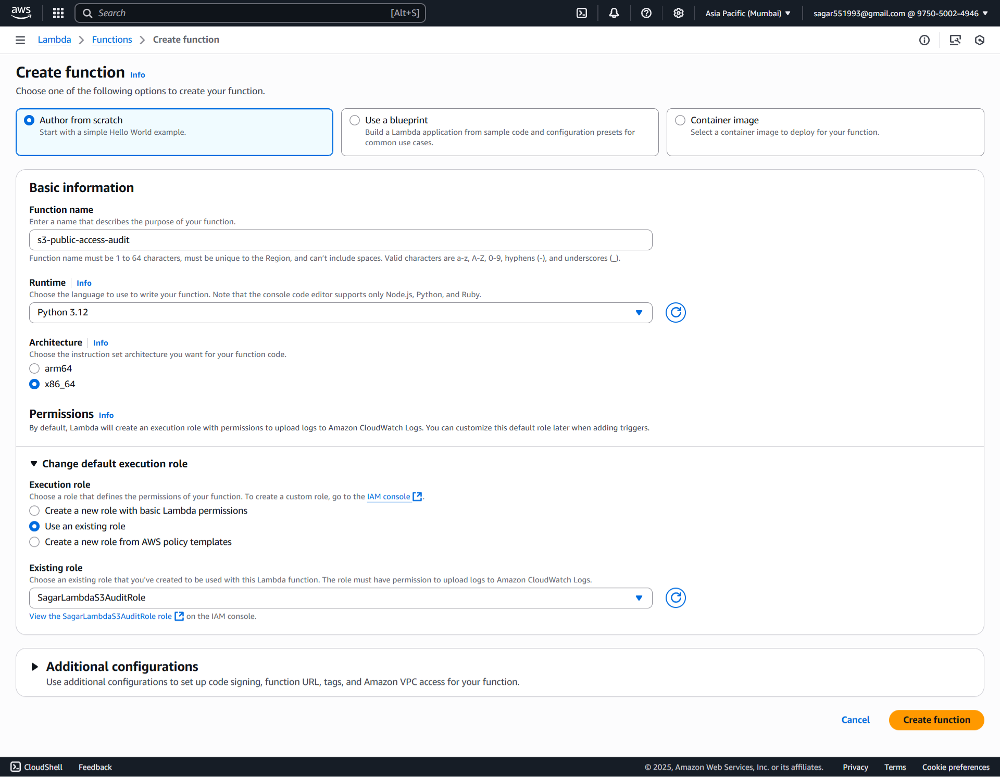
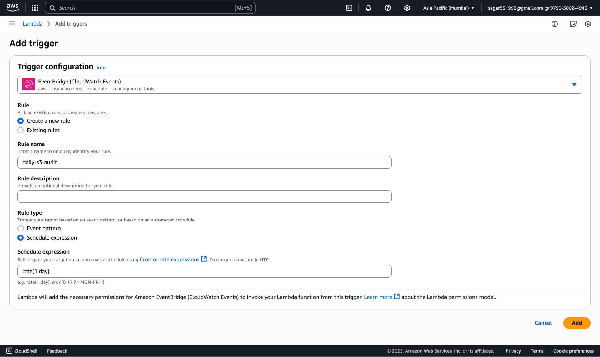
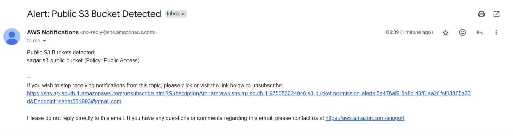

### 🚀 **Assignment 13: Audit S3 Bucket Permissions and Notify for Public Buckets**

#### ✅ Step 1. SNS Setup

##### 📌 1.1. Create an SNS Topic

1. Go to **AWS Management Console** → **SNS** → **Topics**.
2. Click **➕ Create topic**.
3. **Type**: `Standard`
4. **Name**: `s3-bucket-permission-alerts`
5. Click **Create topic**


##### 📧 1.2. Subscribe Your Email

1. Select your newly created topic.
2. Click **Create subscription**.
3. **Protocol**: `Email`
4. **Endpoint**: *Your email address*
5. 📩 Check your email inbox and **confirm the subscription** by clicking the link.



#### 🗂️ **Step 1: Setting Up Your S3 Bucket**

#### 🪣 **1.1 Create Your Bucket**

1. Log into the [AWS S3 Console](https://console.aws.amazon.com/s3/).
2. Click **Create bucket**.
3. Provide a globally unique bucket name (e.g., `sagar-s3-public-bucket`).
4. Choose your preferred region.
5. Uncheck All Block Public Access Options
6. Click **Create bucket**.

#### 📤 **1.2 Add Permission for Public Bucket**

1. Select your bucket.
2. Click Permissions tab
3. You got to Bucket policy then click edit
4. You can add
```
{
    "Version": "2012-10-17",
    "Statement": [
        {
        "Sid": "Statement1",
        "Effect": "Allow",
        "Principal": "*",
        "Action": [
            "s3:GetObject"
        ],
        "Resource": "arn:aws:s3:::sagar-s3-public-bucket/*"
        }
    ]
}
```

#### 📤 **1.3 Uploading Files**

1. Select your bucket.
2. Click **Upload** and add files (images, texts, etc.).
3. Complete the upload.

#### **🔐 Step 2: Create Lambda IAM Role**

##### 🔑 **2.1 Create an IAM Role**

1. Navigate to the [AWS IAM Console](https://console.aws.amazon.com/iam/).
2. Click **Roles > Create role**.
3. Select **AWS service** and choose **Lambda**.
4. Click **Next**.

#### 🛡️ **2.2 Attach Permissions**

1. Search and select `AmazonSNSFullAccess` (for simplicity) and also select `AmazonS3ReadOnlyAccess`.
2. Click **Next**.

#### 📝 **2.3 Finalize Role Creation**

1. Name the role, e.g., `SagarLambdaS3AuditRole`.
2. Click **Create role**.


#### ⚡ **Step 3: Create Lambda Function**

##### 3.1 🏃‍♂️ Go to Lambda Console

1. In AWS Console, 🔎 search for and select **Lambda**.
2. Click **Create function**

##### 3.2 ⚙️ Configure Function

1. **Author from scratch**

   * 📝 Name: `s3-public-access-audit`
   * 🐍 Runtime: **Python 3.12**
2. **Change default execution role:**

   * Select **Use an existing role**
   * Choose the `SagarLambdaS3AuditRole` you just created
3. ✅ Click **Create function**


##### 3.3 Lambda Python Script

For best practice, set this as an **environment variable** in the Lambda console.

```python
import boto3
import os
import json
import botocore

SNS_TOPIC_ARN = os.environ.get('SNS_TOPIC_ARN')

def is_public_policy(policy):
    """Detect if a policy allows public access."""
    if not policy:
        return False
    for stmt in policy.get('Statement', []):
        effect = stmt.get('Effect', '')
        principal = stmt.get('Principal')
        if effect == 'Allow' and (principal == "*" or principal == {"AWS": "*"}) and \
           any(perm in stmt.get('Action', []) for perm in ["s3:GetObject", "s3:PutObject", "s3:*"]):
            return True
    return False

def lambda_handler(event, context):
    s3 = boto3.client('s3')
    sns = boto3.client('sns')
    public_buckets = []

    # List all buckets
    buckets = s3.list_buckets().get('Buckets', [])
    #buckets = [{'Name': "sagar-s3-public-bucket"}]  # Example buckets for testing
    for bucket in buckets:
        bucket_name = bucket['Name']

        # 1. Check bucket ACL
        acl = s3.get_bucket_acl(Bucket=bucket_name)
        for grant in acl.get('Grants', []):
            grantee = grant.get('Grantee', {})
            if grantee.get('Type') == 'Group':
                uri = grantee.get('URI', '')
                # These are the URIs for "AllUsers" (public) and "AuthenticatedUsers"
                if 'AllUsers' in uri or 'AuthenticatedUsers' in uri:
                    permission = grant.get('Permission', '')
                    if permission in ['READ', 'WRITE', 'FULL_CONTROL']:
                        public_buckets.append(f"{bucket_name} (ACL: {permission})")

        # 2. Check bucket policy
        try:
            policy_str = s3.get_bucket_policy(Bucket=bucket_name)['Policy']
            policy = json.loads(policy_str)
            if is_public_policy(policy):
                public_buckets.append(f"{bucket_name} (Policy: Public Access)")
        except botocore.exceptions.ClientError as e:
            pass

    # Notify if public buckets found
    if public_buckets:
        message = "Public S3 Buckets detected:\n" + "\n".join(public_buckets)
        sns.publish(
            TopicArn=SNS_TOPIC_ARN,
            Subject="Alert: Public S3 Bucket Detected",
            Message=message
        )
    else:
        print("No public buckets detected.")
    return {"public_buckets": public_buckets}
```

Click **Deploy**.

##### 🛠️ **3.4 Configure Environment Variables**

1. Click on the **Configuration** tab in Lambda.
2. Go to **Environment variables** and add:

   * `SNS_TOPIC_ARN`: e.g., `arn:aws-xxxxx`
3. Click **Save**.

#### **⏰ Step 4 Schedule Lambda with CloudWatch Events**

1. Go to your Lambda function.
2. Click **Add trigger** > **EventBridge (CloudWatch Events)**.
3. Set the schedule expression (e.g., `rate(1 day)`).
4. Click **Add**.


#### **🧪 Step 5: Manual Test & Automation & Validation**
##### 5.1 🧑‍🔬 Test in Lambda Console

1. In your Lambda function page, click **Test**.
2. For the first time, it asks to "Configure test event":

   * 📝 **Event name:** (`test-s3-audit`)
   - Leave the event JSON as `{}` (empty event)
   * Click **Save**
3. 🟢 Click **Test** (again) to **run** the function.
4. Check your email for the SNS alert.

##### 5.2 Automation
- A daily email is sent with your subscription details automatically.

##### 5.3 🔍 Validation
