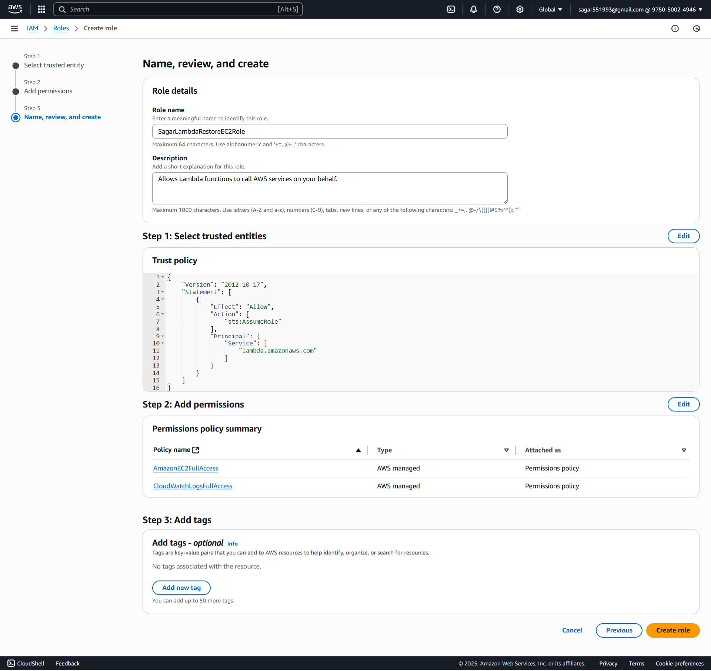
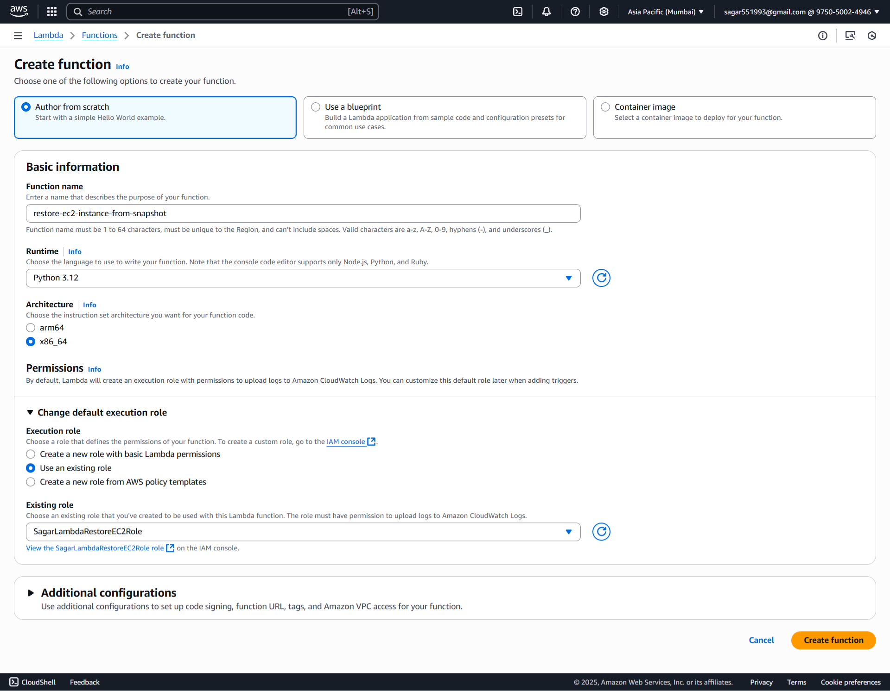
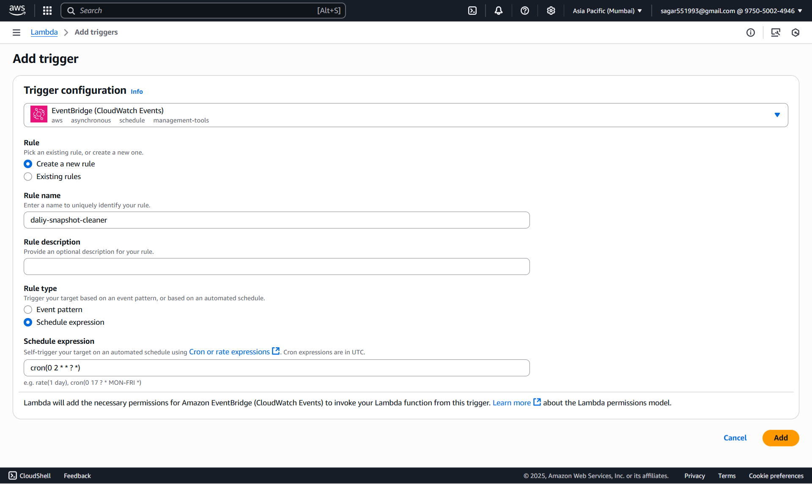
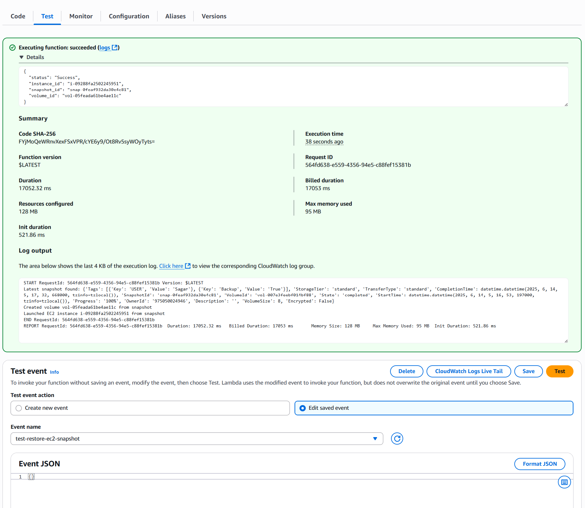
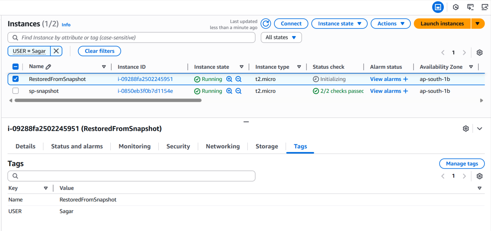

### 🚀 **Assignment 17: Restore EC2 Instance from Snapshot**
#### **🔐 Step 1: Create Lambda IAM Role**

##### 🔑 **1.1 Create an IAM Role**

1. Navigate to the [AWS IAM Console](https://console.aws.amazon.com/iam/).
2. Click **Roles > Create role**.
3. Select **AWS service** and choose **Lambda**.
4. Click **Next**.

#### 🛡️ **1.2 Attach Permissions**

1. Search and select `AmazonEC2FullAccess` (for simplicity) & also add `CloudWatchLogsFullAccess`.
2. Click **Next**.

#### 📝 **1.3 Finalize Role Creation**

1. Name the role, e.g., `SagarLambdaRestoreEC2Role`.
2. Click **Create role**.


#### ⚡ **Step 2: Create Lambda Function**

##### 2.1 🏃‍♂️ Go to Lambda Console

1. In AWS Console, 🔎 search for and select **Lambda**.
2. Click **Create function**

##### 2.2 ⚙️ Configure Function

1. **Author from scratch**

   * 📝 Name: `restore-ec2-instance-from-snapshot`
   * 🐍 Runtime: **Python 3.12**
2. **Change default execution role:**

   * Select **Use an existing role**
   * Choose the `SagarLambdaRestoreEC2Role` you just created
3. ✅ Click **Create function**


##### 2.3 Lambda Python Script

For best practice, set this as an **environment variable** in the Lambda console.

```python
import boto3
import os

# CONFIGURATION
INSTANCE_TYPE = os.environ.get('INSTANCE_TYPE','t2.micro')
KEY_NAME = os.environ.get('KEY_NAME', 'sagar-key')
SECURITY_GROUP_IDS_VALUE = os.environ.get('SECURITY_GROUP_IDS_VALUE')
SECURITY_GROUP_IDS = SECURITY_GROUP_IDS_VALUE.split(',') if SECURITY_GROUP_IDS_VALUE else []
SUBNET_ID = os.environ.get('SUBNET_ID','subnet-xxxxxxxx')
VOLUME_TAG_KEY = os.environ.get('VOLUME_TAG_KEY','Backup')
VOLUME_TAG_VALUE = os.environ.get('VOLUME_TAG_VALUE','True')
AVAILABILITY_ZONE = os.environ.get('AVAILABILITY_ZONE','ap-south-1a')
IMAGE_ID = os.environ.get('IMAGE_ID', 'ami-0fc5d935ebf8bc3bc')  # Dummy AMI for networking

ec2 = boto3.client('ec2')

def lambda_handler(event, context):
    # Step 1: Find the latest snapshot with specific tags
    snapshots = ec2.describe_snapshots(
        Filters=[
            {'Name': 'tag:' + VOLUME_TAG_KEY, 'Values': [VOLUME_TAG_VALUE]},
            {'Name': 'tag:USER', 'Values': ['Sagar']}
        ],
        OwnerIds=['self']
    )['Snapshots']
    
    if not snapshots:
        raise Exception("No snapshots found with the given tag")

    latest_snapshot = max(snapshots, key=lambda x: x['StartTime'])
    print(f"Latest snapshot found: {latest_snapshot}")
    # Step 2: Create a volume from the latest snapshot
    volume_response = ec2.create_volume(
        SnapshotId=latest_snapshot['SnapshotId'],
        AvailabilityZone=AVAILABILITY_ZONE,
        VolumeType='gp3',
        TagSpecifications=[
            {
                'ResourceType': 'volume',
                'Tags': [{'Key': 'RestoredFrom', 'Value': latest_snapshot['SnapshotId']}]
            }
        ]
    )
    volume_id = volume_response['VolumeId']
    print(f"Created volume {volume_id} from snapshot")

    # Wait for volume to become available
    waiter = ec2.get_waiter('volume_available')
    waiter.wait(VolumeIds=[volume_id])

    # Step 3: Launch a new EC2 instance with this volume as the root
    instance_response = ec2.run_instances(
        ImageId=IMAGE_ID,  # Use a dummy AMI for networking; will detach its root.
        InstanceType=INSTANCE_TYPE,
        KeyName=KEY_NAME,
        MaxCount=1,
        MinCount=1,
        NetworkInterfaces=[
            {
                'DeviceIndex': 0,
                'SubnetId': SUBNET_ID,
                'Groups': SECURITY_GROUP_IDS,
                'AssociatePublicIpAddress': True
            }
        ],
        BlockDeviceMappings=[
            {
                'DeviceName': '/dev/xvda',
                'Ebs': {
                    'VolumeSize': latest_snapshot['VolumeSize'],
                    'VolumeType': 'gp3',
                    'DeleteOnTermination': True,
                    'SnapshotId': latest_snapshot['SnapshotId']
                }
            }
        ],
        TagSpecifications=[
            {
                'ResourceType': 'instance',
                'Tags': [{'Key': 'Name', 'Value': 'RestoredFromSnapshot'},{'Key': 'USER', 'Value': 'Sagar'}]
            }
        ]
    )

    instance_id = instance_response['Instances'][0]['InstanceId']
    print(f"Launched EC2 instance {instance_id} from snapshot")

    return {
        'status': 'Success',
        'instance_id': instance_id,
        'snapshot_id': latest_snapshot['SnapshotId'],
        'volume_id': volume_id
    }
```

Click **Deploy**.

##### 🛠️ **2.4 Configure Environment Variables**

1. Click on the **Configuration** tab in Lambda.
2. Go to **Environment variables** and add:

   * `INSTANCE_TYPE`: e.g., `t2.micro`
   * `KEY_NAME`: e.g., `sagar-key`
   * `SECURITY_GROUP_IDS_VALUE`: e.g., `sg-1xxxx,sg-2xxxx`
   * `SUBNET_ID`: e.g., `subnet-xxxxxxxx`
   * `VOLUME_TAG_KEY`: e.g., `Backup`
   * `VOLUME_TAG_VALUE`: e.g., `True`
   * `AVAILABILITY_ZONE`: e.g., `ap-south-1a`
   * `IMAGE_ID`: e.g., `ami-0fc5d935ebf8bc3bc`

Click **Save**.

#### **⏰ Step 3 Schedule Lambda with CloudWatch Events**

1. Go to your Lambda function.
2. Click **Add trigger** > **EventBridge (CloudWatch Events)**.
3. Name: `daliy-snapshot-cleaner`
4. Set the schedule expression (e.g., `cron(0 2 * * ? *)` for 2 AM UTC daily).
5. Click **Add**.


#### **🧪 Step 4: Manual Test & Validation**
##### 4.1 🧑‍🔬 Test in Lambda Console

1. In your Lambda function page, click **Test**.
2. For the first time, it asks to "Configure test event":

   * 📝 **Event name:** (`test-restore-ec2-snapshot`)
   - Leave the event JSON as `{}` (empty event)
   * Click **Save**
3. 🟢 Click **Test** (again) to **run** the function.

##### 4.2 🔍 Validation
