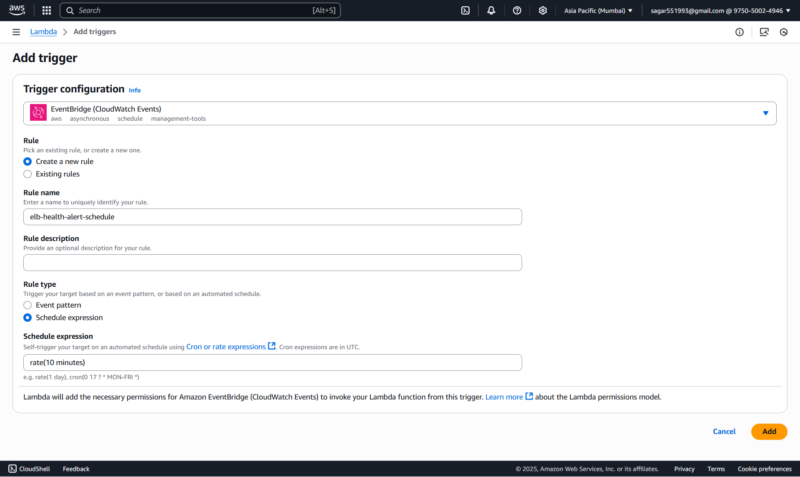

### 🚀 **Assignment 19: Load Balancer Health Checker**

#### ✅ Step 1. SNS Setup

##### 📌 1.1. Create an SNS Topic

1. Go to **AWS Management Console** → **SNS** → **Topics**.
2. Click **➕ Create topic**.
3. **Type**: `Standard`
4. **Name**: `elb-instance-health-alerts`
5. Click **Create topic**


##### 📧 1.2. Subscribe Your Email

1. Select your newly created topic.
2. Click **Create subscription**.
3. **Protocol**: `Email`
4. **Endpoint**: *Your email address*
5. 📩 Check your email inbox and **confirm the subscription** by clicking the link.


#### **🔐 Step 2: Create Lambda IAM Role**

##### 🔑 **2.1 Create an IAM Role**

1. Navigate to the [AWS IAM Console](https://console.aws.amazon.com/iam/).
2. Click **Roles > Create role**.
3. Select **AWS service** and choose **Lambda**.
4. Click **Next**.

#### 🛡️ **2.2 Attach Permissions**

1. Permissions policies.
    - `ElasticLoadBalancingFullAccess`
    - `AmazonSNSFullAccess`
2. Click **Next**.

#### 📝 **2.3 Finalize Role Creation**

1. Name the role, e.g., `alb-health-lambda-role`.
2. Click **Create role**.


#### ⚡ **Step 3: Create Lambda Function**

##### 3.1 🏃‍♂️ Go to Lambda Console

1. In AWS Console, 🔎 search for and select **Lambda**.
2. Click **Create function**

##### 3.2 ⚙️ Configure Function

1. **Author from scratch**

   * 📝 Name: `ALBTargetHealthChecker`
   * 🐍 Runtime: **Python 3.12**
2. **Change default execution role:**

   * Select **Use an existing role**
   * Choose the `alb-health-lambda-role` you just created
3. ✅ Click **Create function**


##### 3.3 Lambda Python Script

For best practice, set this as an **environment variable** in the Lambda console.

```python
import boto3
import os

TARGET_GROUP_ARN = os.environ.get("TARGET_GROUP_ARN")
SNS_TOPIC_ARN = os.environ.get("SNS_TOPIC_ARN")

elbv2 = boto3.client('elbv2')
sns = boto3.client('sns')

def lambda_handler(event, context):
    try:
        response = elbv2.describe_target_health(TargetGroupArn=TARGET_GROUP_ARN)
        target_health_descriptions = response['TargetHealthDescriptions']

        unhealthy_targets = [
            t for t in target_health_descriptions 
            if t['TargetHealth']['State'] != 'healthy'
        ]

        if unhealthy_targets:
            msg_lines = [
                f"Unhealthy targets detected in Target Group:",
                f"Target Group ARN: {TARGET_GROUP_ARN}",
                ""
            ]
            for t in unhealthy_targets:
                target = t['Target']
                health = t['TargetHealth']
                msg_lines.append(
                    f"Target ID: {target['Id']}, Port: {target['Port']}, "
                    f"State: {health['State']}, Reason: {health.get('Reason','')}, "
                    f"Description: {health.get('Description','')}"
                )
            message = "\n".join(msg_lines)

            sns.publish(
                TopicArn=SNS_TOPIC_ARN,
                Subject="ALERT: Unhealthy targets in ALB Target Group",
                Message=message
            )
        else:
            print("All targets are healthy.")

    except Exception as e:
        print(f"Error: {e}")
```

Click **Deploy**.

##### 🛠️ **3.4 Configure Environment Variables**

1. Click on the **Configuration** tab in Lambda.
2. Go to **Environment variables** and add:
   * `TARGET_GROUP_ARN`: e.g., `tg-alb-500-error`
   * `SNS_TOPIC_ARN`: e.g., `arn:aws-xxxxx`
3. Click **Save**.

#### **⏰ Step 4 Schedule Lambda with CloudWatch Events**

1. Go to your Lambda function.
2. Click **Add trigger** > **EventBridge (CloudWatch Events)**.
3. Name: `elb-health-alert-schedule`
3. Set the schedule expression (e.g., `rate(10 minutes)`).
4. Click **Add**.


#### **🧪 Step 5: Manual Test & Automation & Validation**
##### 5.1 🧑‍🔬 Test in Lambda Console
- To test, manually set a target in your group as unhealthy or stop the EC2 instance
- Wait 10 minutes or trigger Lambda manually to verify email alert

1. In your Lambda function page, click **Test**.
2. For the first time, it asks to "Configure test event":

   * 📝 **Event name:** (`test-alb-health-alert`)
   - Leave the event JSON as `{}` (empty event)
   * Click **Save**
3. 🟢 Click **Test** (again) to **run** the function.
4. Check your email for the SNS alert.

##### 5.3 🔍 Validation

