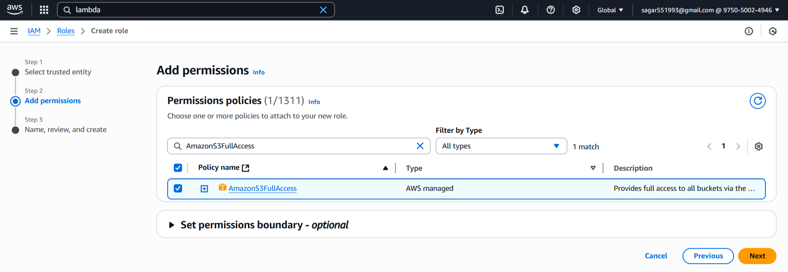
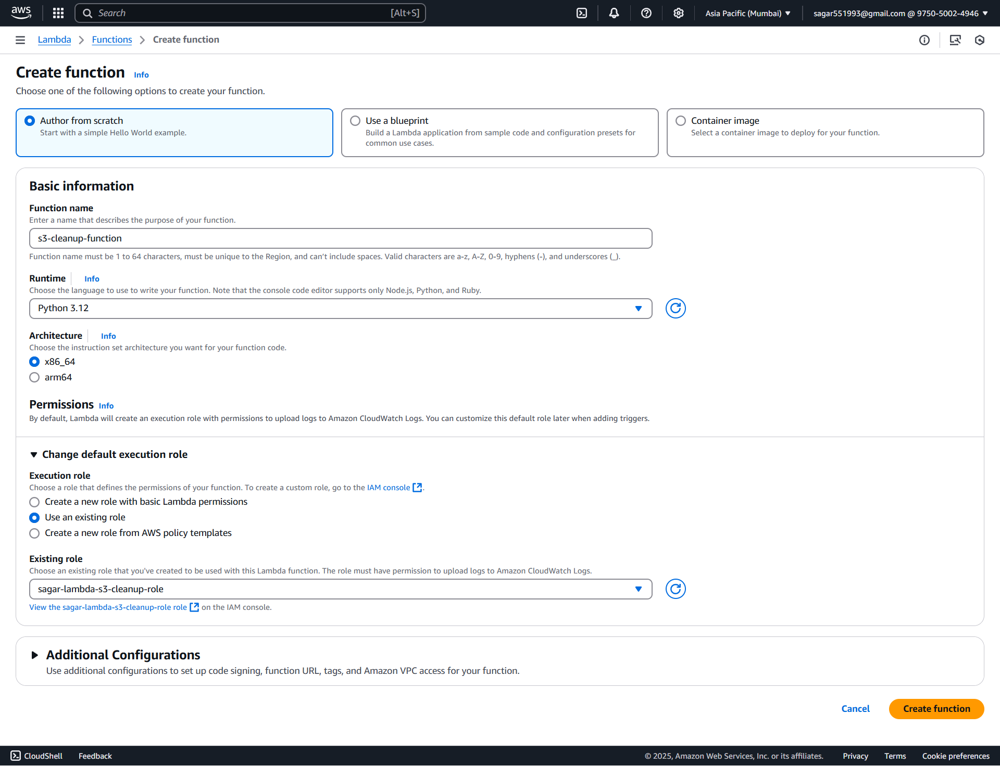
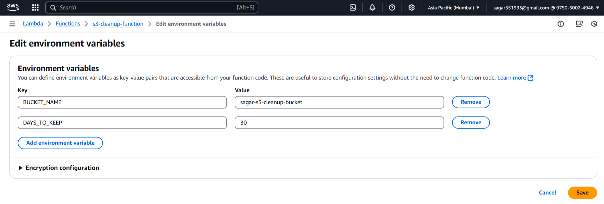
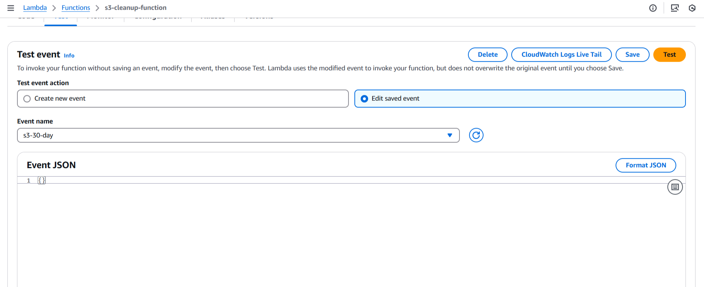
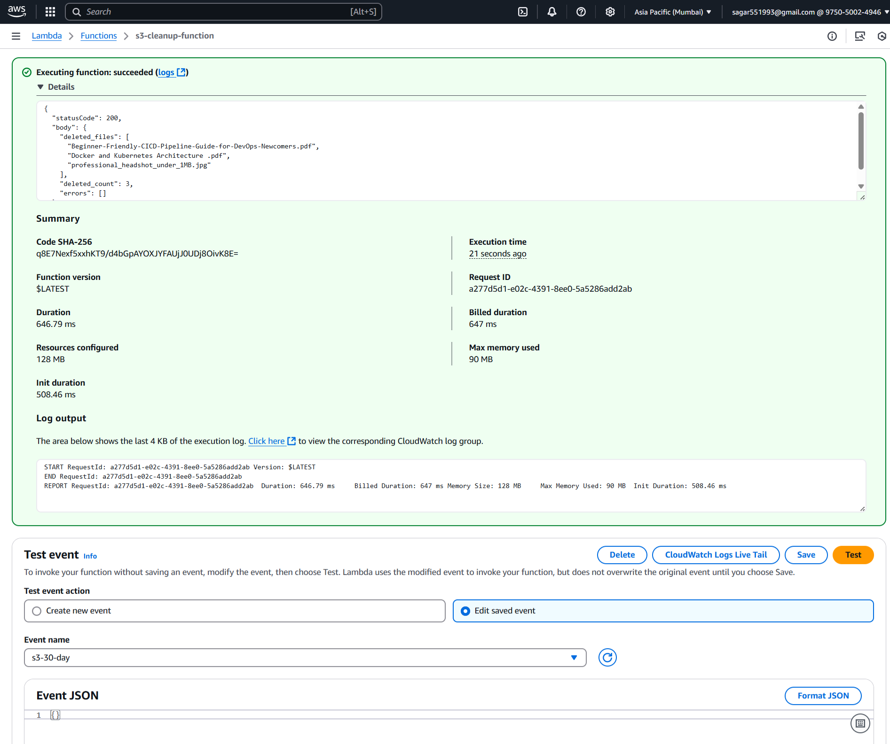

### 📚 **Assignment 2: Automated S3 Bucket Cleanup Using AWS Lambda and Boto3**

#### 🗂️ **Step 1: Setting Up Your S3 Bucket**

#### 🪣 **1.1 Create Your Bucket**

1. Log into the [AWS S3 Console](https://console.aws.amazon.com/s3/).
2. Click **Create bucket**.
3. Provide a globally unique bucket name (e.g., `sagar-s3-cleanup-bucket`).
4. Choose your preferred region.
5. Click **Create bucket**.

#### 📤 **1.2 Uploading Files**

1. Select your bucket.
2. Click **Upload** and add files (images, texts, etc.).
3. Complete the upload.

#### 🔐 **Step 2: IAM Role for Lambda**

##### 🔑 **2.1 Create an IAM Role**

1. Navigate to the [AWS IAM Console](https://console.aws.amazon.com/iam/).
2. Click **Roles > Create role**.
3. Select **AWS service** and choose **Lambda**.
4. Click **Next**.

#### 🛡️ **2.2 Attach Permissions**

1. Search and select `AmazonS3FullAccess` (for simplicity).
2. Click **Next**.

#### 📝 **2.3 Finalize Role Creation**

1. Name the role, e.g., `sagar-lambda-s3-cleanup-role`.
2. Click **Create role**.


#### ⚡ **Step 3: Create Lambda Function**

##### 3.1 🏃‍♂️ Go to Lambda Console

1. In AWS Console, 🔎 search for and select **Lambda**.
2. Click **Create function**

##### 3.2 ⚙️ Configure Function

1. **Author from scratch**

   * 📝 Name: `s3-cleanup-function`
   * 🐍 Runtime: **Python 3.12**
2. **Change default execution role:**

   * Select **Use an existing role**
   * Choose the `sagar-lambda-s3-cleanup-role` you just created
3. ✅ Click **Create function**


##### 📝 **3.2 Lambda Function Code**

Paste the following Python code in **Function code**:

```python
import boto3
from datetime import datetime, timezone, timedelta
import os

BUCKET_NAME = os.environ.get('BUCKET_NAME', 'sagar-s3-cleanup-bucket')
DAYS_TO_KEEP = int(os.environ.get('DAYS_TO_KEEP', 30))

s3 = boto3.client('s3')

def lambda_handler(event, context):
    """
        Lambda function to delete files older than DAYS_TO_KEEP days from the S3 bucket.
    """
    now = datetime.now(timezone.utc)
    cutoff = now - timedelta(days=DAYS_TO_KEEP)
    deleted_files = []
    errors = []

    paginator = s3.get_paginator('list_objects_v2')

    for page in paginator.paginate(Bucket=BUCKET_NAME):
        for obj in page.get('Contents', []):
            key = obj['Key']
            last_modified = obj['LastModified']
            if last_modified < cutoff:
                try:
                    # Attempt to delete the object
                    s3.delete_object(Bucket=BUCKET_NAME, Key=key)
                    deleted_files.append(key)
                except Exception as e:
                    # Collect error info for result/reporting
                    errors.append({'key': key, 'error': str(e)})
    return {
        'statusCode': 200 if not errors else 207,
        'body': {
            'deleted_files': deleted_files,
            'deleted_count': len(deleted_files),
            'errors': errors
        }
    }
```

Click **Deploy**.

##### 🛠️ **3.3 Configure Environment Variables**

1. Click on the **Configuration** tab in Lambda.
2. Go to **Environment variables** and add:

   * `BUCKET_NAME`: e.g., `sagar-s3-cleanup-bucket`
   * `DAYS_TO_KEEP`: e.g., `30`

Click **Save**.



---

#### 🧪 **Step 4: Test and Verify Lambda Function**

##### 4.1 🧑‍🔬 Test in Lambda Console


1. In your Lambda function page, click **Test**.
2. For the first time, it asks to "Configure test event":

   * 📝 **Event name:** (`s3-30-day`)
   * Leave the event JSON as `{}` (empty event)
   * Click **Save**
3. 🟢 Click **Test** (again) to **run** the function.


##### 4.2 🔍 S3 Verification

1. Return to your S3 bucket.
2. Refresh the view to confirm files older than your configured days have been deleted.