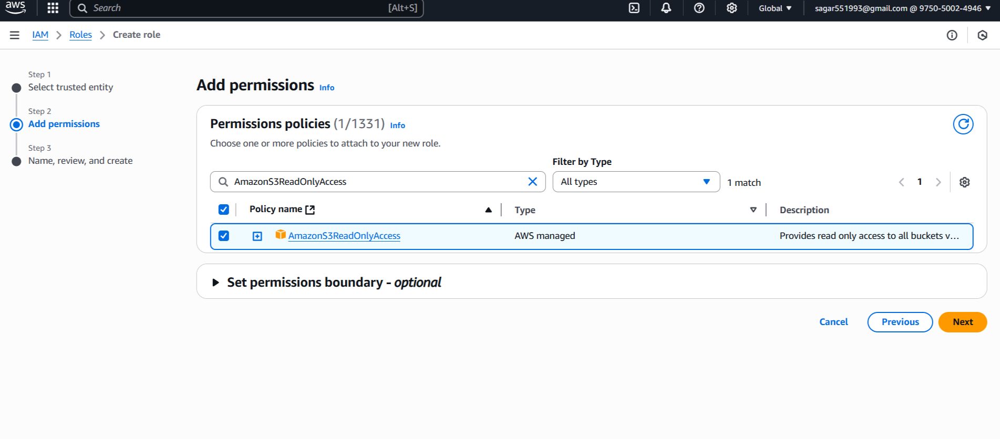
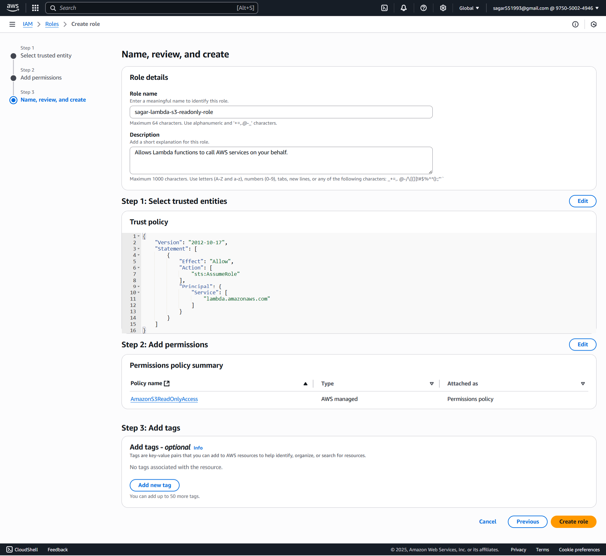
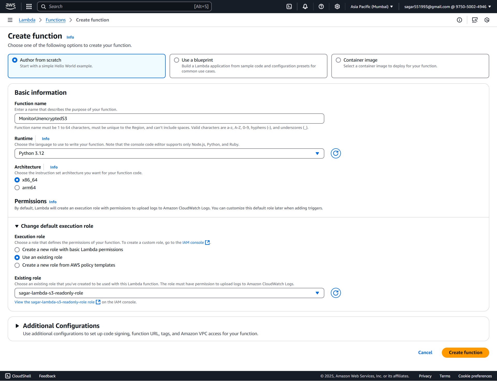
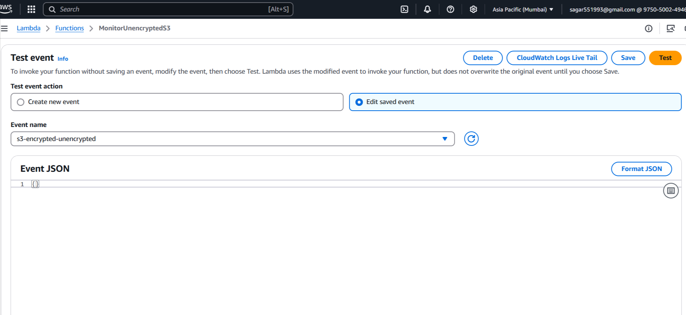
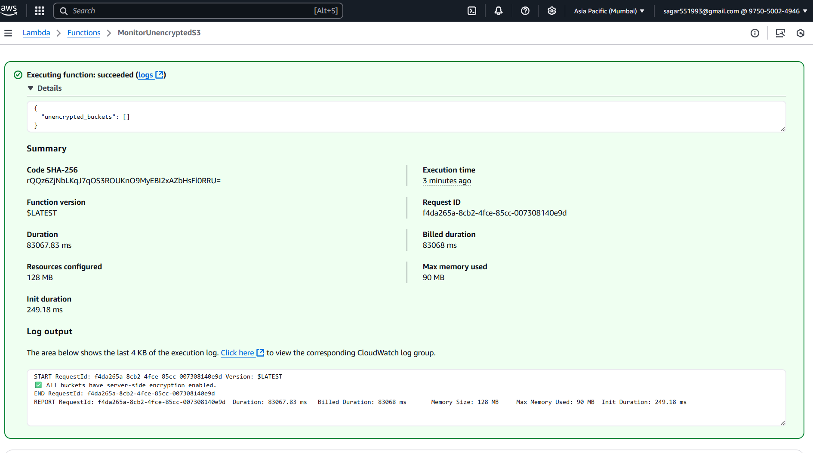

### 🎯 **Assignment 3: Monitor Unencrypted S3 Buckets Using AWS Lambda and Boto3**

#### 📤 **Step 1: S3 Setup**

1. **Go to the [AWS S3 Console](https://console.aws.amazon.com/s3/).**
2. **Create several buckets.**

   * For demo: Create at least two **without** encryption, and one **with** server-side encryption enabled.

#### 🔐 **Step 2: IAM Role for Lambda**

##### 🔑 **2.1 Create an IAM Role**

1. Navigate to the [AWS IAM Console](https://console.aws.amazon.com/iam/).
2. Click **Roles > Create role**.
3. Select **AWS service** and choose **Lambda**.
4. Click **Next**.

#### 🛡️ **2.2 Attach Permissions**

1. Search and select `AmazonS3ReadOnlyAccess` (for simplicity).
2. Click **Next**.

#### 📝 **2.3 Finalize Role Creation**

1. Name the role, e.g., `sagar-lambda-s3-readonly-role`.
2. Click **Create role**.


#### ⚡ **Step 3: Create Lambda Function**

##### 3.1 🏃‍♂️ Go to Lambda Console

1. In AWS Console, 🔎 search for and select **Lambda**.
2. Click **Create function**

##### 3.2 ⚙️ Configure Function

1. **Author from scratch**

   * 📝 Name: `MonitorUnencryptedS3`
   * 🐍 Runtime: **Python 3.12**
2. **Change default execution role:**

   * Select **Use an existing role**
   * Choose the `sagar-lambda-s3-readonly-role` you just created
3. ✅ Click **Create function**


##### 📝 **3.2 Lambda Function Code**

Paste the following Python code in **Function code**:

```python
import boto3
from botocore.exceptions import ClientError

def lambda_handler(event, context):
    """
    AWS Lambda function to detect S3 buckets without default server-side encryption.
    Returns a list of unencrypted bucket names.
    """
    s3 = boto3.client('s3')
    unencrypted_buckets = []

    # List all buckets in the account
    try:
        response = s3.list_buckets()
        buckets_to_check = response.get('Buckets', [])
    except ClientError as e:
        print(f"❌ Error listing buckets: {e}")
        return {"unencrypted_buckets": []}

    for bucket_name in buckets_to_check:
        # bucket_name = bucket['Name']
        try:
            s3.get_bucket_encryption(Bucket=bucket_name)
        except ClientError as e:
            error_code = e.response['Error']['Code']
            if error_code == 'ServerSideEncryptionConfigurationNotFoundError':
                unencrypted_buckets.append(bucket_name)
            else:
                print(f"⚠️  Error checking {bucket_name}: {e}")

    if unencrypted_buckets:
        print("\n🔒 Unencrypted Buckets Detected:")
        for b in unencrypted_buckets:
            print(f"❌ {b}")
    else:
        print("\n✅ All buckets have server-side encryption enabled.")

        # Return for integration/automation
        return {"unencrypted_buckets": unencrypted_buckets}
```

Click **Deploy**.

#### 🧪 **Step 4: Test and Verify Lambda Function**

##### 4.1 🧑‍🔬 Test in Lambda Console

1. In your Lambda function page, click **Test**.
2. For the first time, it asks to "Configure test event":

   * 📝 **Event name:** (`s3-encrypted-unencrypted`)
   * Leave the event JSON as `{}` (empty event)
   * Click **Save**
3. 🟢 Click **Test** (again) to **run** the function.

##### 4.2 🔍 S3 Verification


#### **Result Example in Logs**

```
🔒 Unencrypted Buckets Detected:
❌ my-bucket-no-encryption
❌ test-unsecure-bucket
```

or

```
✅ All buckets have server-side encryption enabled.
```