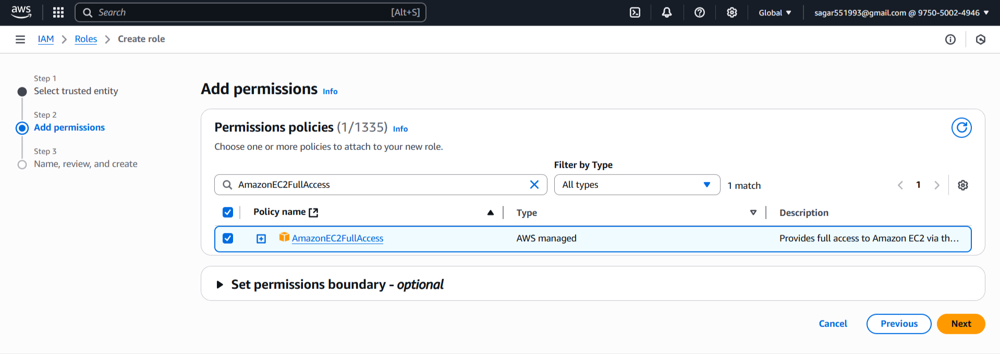
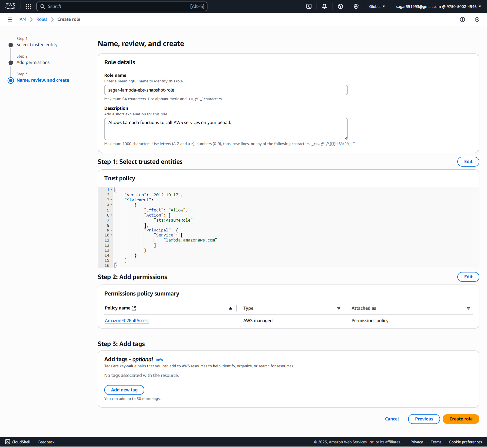
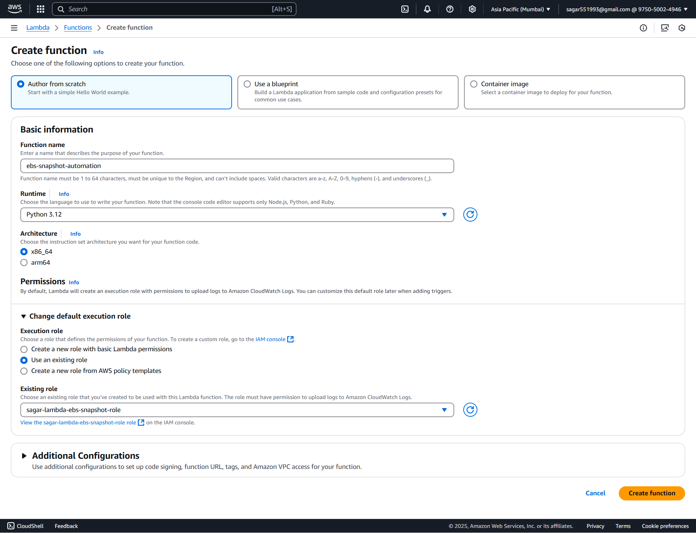
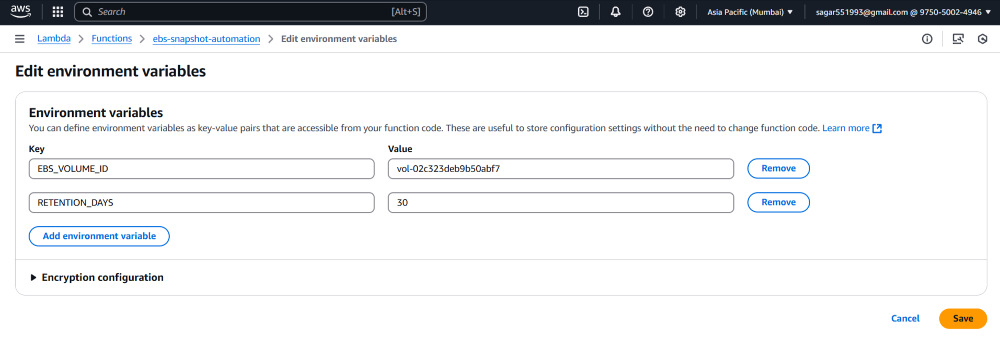
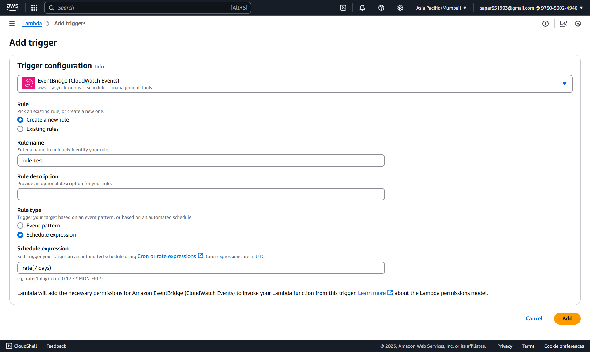
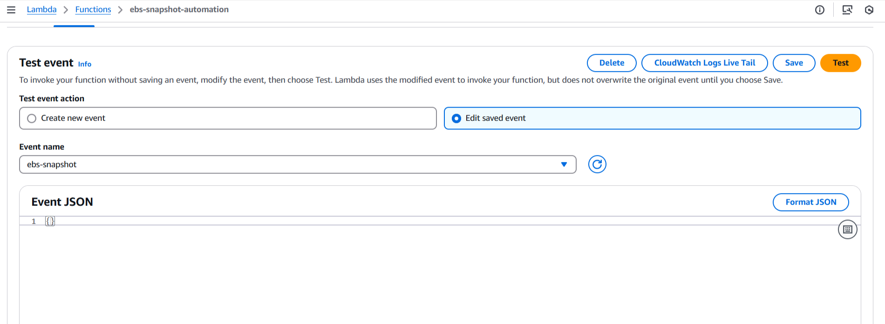
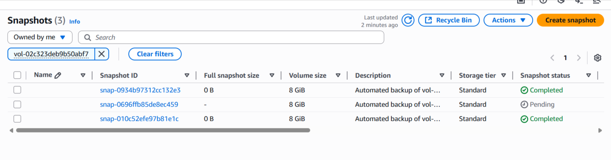
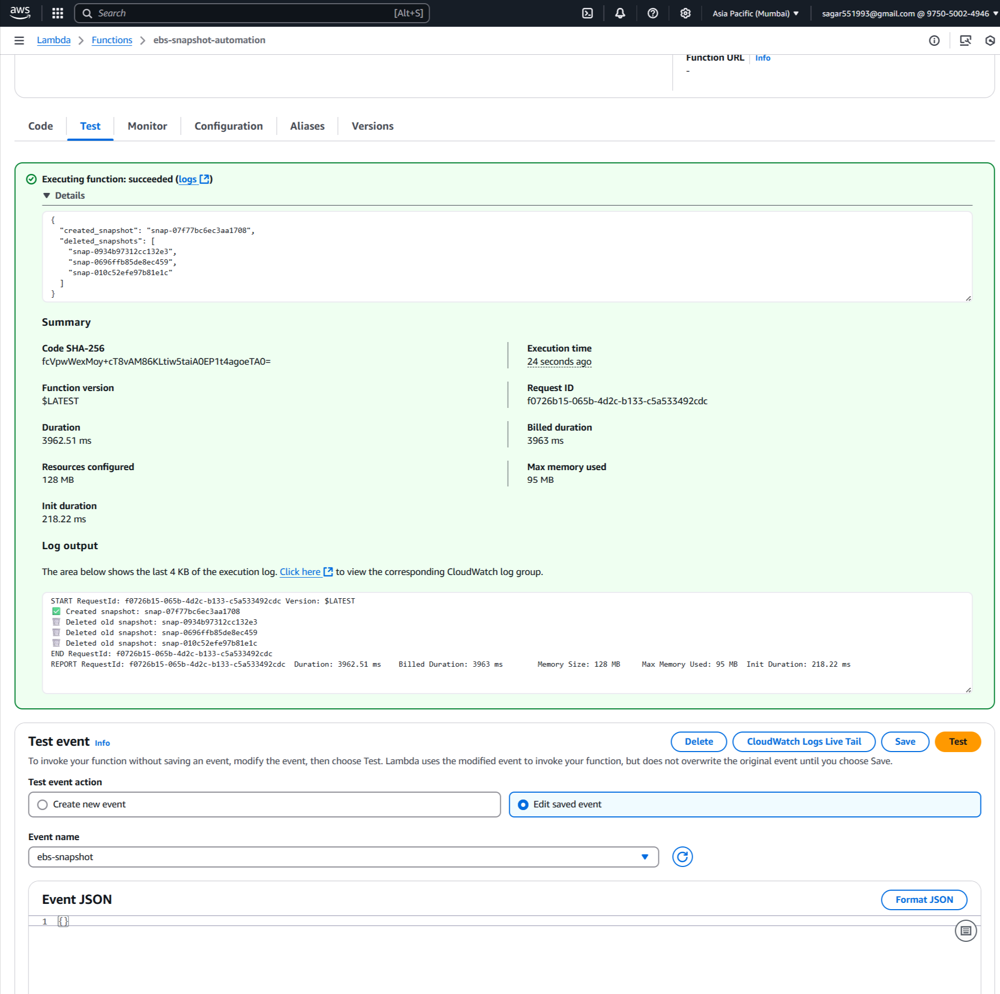

### 🚀 **Assignment 4: Automatic EBS Snapshot and Cleanup Using AWS Lambda and Boto3**

#### **🪣 Step 1: EBS Setup**

##### 1.1 Identify or Create EBS Volume

1. Go to the [AWS EC2 Console](https://console.aws.amazon.com/ec2/).
2. In the left sidebar, click **Volumes** under **Elastic Block Store**.
3. To use an existing volume, **note the Volume ID** (e.g., `vol-0abcd1234ef567890`).
4. Or, click **Create Volume** and set:

   * Size, Availability Zone (must match your EC2 instance), and other settings.
   * Click **Create Volume**.
5. Attach the volume to an EC2 instance if needed.

#### **🔐 Step 2: Create Lambda IAM Role**

##### 🔑 **2.1 Create an IAM Role**

1. Navigate to the [AWS IAM Console](https://console.aws.amazon.com/iam/).
2. Click **Roles > Create role**.
3. Select **AWS service** and choose **Lambda**.
4. Click **Next**.

#### 🛡️ **2.2 Attach Permissions**

1. Search and select `AmazonEC2FullAccess` (for simplicity).
2. Click **Next**.

#### 📝 **2.3 Finalize Role Creation**

1. Name the role, e.g., `sagar-lambda-ebs-snapshot-role`.
2. Click **Create role**.


#### ⚡ **Step 3: Create Lambda Function**

##### 3.1 🏃‍♂️ Go to Lambda Console

1. In AWS Console, 🔎 search for and select **Lambda**.
2. Click **Create function**

##### 3.2 ⚙️ Configure Function

1. **Author from scratch**

   * 📝 Name: `ebs-snapshot-automation`
   * 🐍 Runtime: **Python 3.12**
2. **Change default execution role:**

   * Select **Use an existing role**
   * Choose the `sagar-lambda-ebs-snapshot-role` you just created
3. ✅ Click **Create function**


##### 3.3 Lambda Python Script

For best practice, set this as an **environment variable** in the Lambda console.

```python
import boto3
import os
from datetime import datetime, timezone, timedelta

# def lambda_handler(event, context):
def lambda_handler():
    ec2 = boto3.client('ec2')
    
    # Environment variables (required: EBS_VOLUME_ID, RETENTION_DAYS)
    volume_id = os.environ.get('EBS_VOLUME_ID')
    retention_days = int(os.environ.get('RETENTION_DAYS', '30'))  # Default 30 days

    if not volume_id:
        raise ValueError("Missing required environment variable: EBS_VOLUME_ID")

    # 1. Create Snapshot
    try:
        desc = f"Automated backup of {volume_id} @ {datetime.now(timezone.utc).isoformat()}"
        snap = ec2.create_snapshot(VolumeId=volume_id, Description=desc)
        created_snap_id = snap['SnapshotId']
        print(f"✅ Created snapshot: {created_snap_id}")
    except Exception as e:
        print(f"❌ Snapshot creation failed: {e}")
        raise

    # 2. Delete Old Snapshots
    cutoff = datetime.now(timezone.utc) - timedelta(days=retention_days)
    deleted_snaps = []
    try:
        snaps = get_completed_snapshots(ec2, volume_id)

        for snapshot in snaps:
            snap_id = snapshot['SnapshotId']
            start_time = snapshot['StartTime']
            if start_time < cutoff:
                try:
                    ec2.delete_snapshot(SnapshotId=snap_id)
                    deleted_snaps.append(snap_id)
                    print(f"🗑️ Deleted old snapshot: {snap_id}")
                except Exception as delete_err:
                    print(f"❌ Failed to delete snapshot {snap_id}: {delete_err}")

        if not deleted_snaps:
            print("✅ No old snapshots to delete.")

    except Exception as e:
        print(f"❌ Snapshot cleanup failed: {e}")
        raise

    return {
        "created_snapshot": created_snap_id,
        "deleted_snapshots": deleted_snaps
    }

def get_completed_snapshots(ec2, volume_id):
    """Return all completed snapshots for a given EBS volume, owned by this account."""
    try:
        response = ec2.describe_snapshots(
            Filters=[
                {'Name': 'volume-id', 'Values': [volume_id]},
                {'Name': 'status', 'Values': ['completed']}
            ],
            OwnerIds=['self']
        )
        snapshots = response.get('Snapshots', [])
        
        return snapshots
    except Exception as e:
        return []
```

##### 🛠️ **3.4 Configure Environment Variables**

1. Click on the **Configuration** tab in Lambda.
2. Go to **Environment variables** and add:

   * `EBS_VOLUME_ID`: e.g., `vol-02c323deb9b50abf7`
   * `RETENTION_DAYS`: e.g., `30`

Click **Save**.



#### **⏰ Step 4 (Bonus): Schedule Lambda with CloudWatch Events**

1. Go to your Lambda function.
2. Click **Add trigger** > **EventBridge (CloudWatch Events)**.
3. Set the schedule expression (e.g., `rate(7 days)` for weekly).
4. Click **Add**.


#### **🧪 Step 5: Manual Test & Validation**
##### 5.1 🧑‍🔬 Test in Lambda Console

1. In your Lambda function page, click **Test**.
2. For the first time, it asks to "Configure test event":

   * 📝 **Event name:** (`ebs-snapshot`)
   * Leave the event JSON as `{}` (empty event)
   * Click **Save**
3. 🟢 Click **Test** (again) to **run** the function.

##### 5.2 🔍 S3 Verification
1. Go to the EC2 **Snapshots** section to see a new snapshot.
2. If you already had old snapshots (>30 days), confirm that they are deleted.

