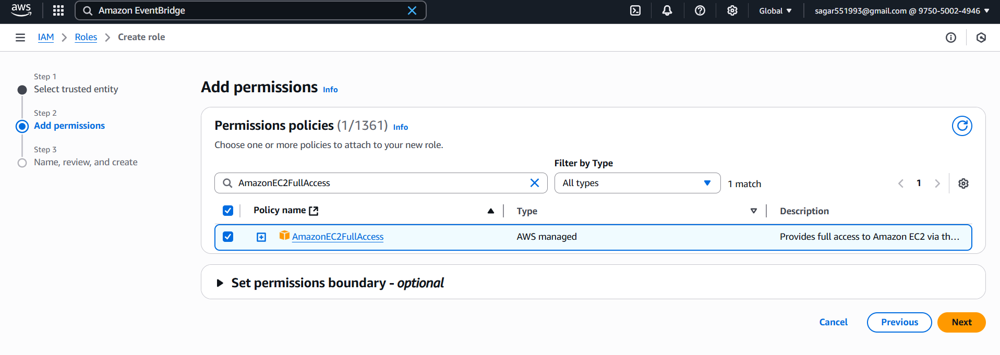
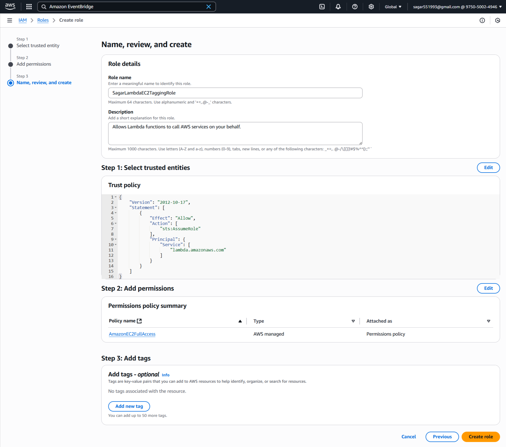
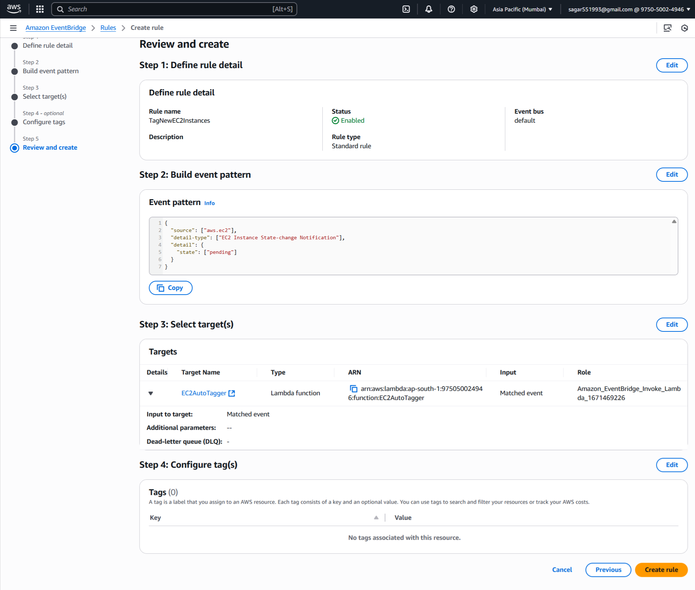
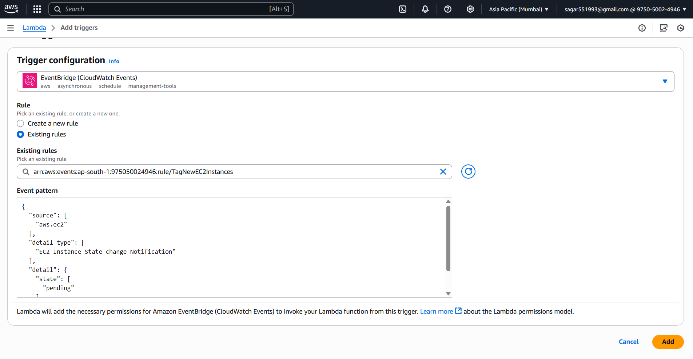
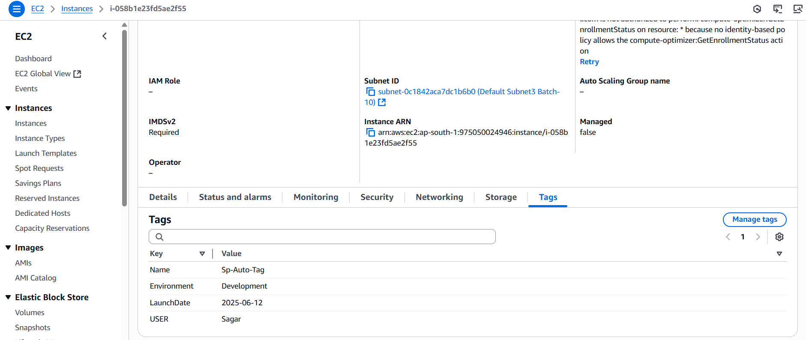

### 🚀 **Assignment 5: Auto-Tagging EC2 Instances on Launch Using AWS Lambda and Boto3**

#### **🪣 Step 1: EC2 Setup**
Ensure:
1. You have permissions to **launch EC2 instances**.
5. You can view tags in the EC2 dashboard.

#### **🔐 Step 2: Create Lambda IAM Role**

##### 🔑 **2.1 Create an IAM Role**

1. Navigate to the [AWS IAM Console](https://console.aws.amazon.com/iam/).
2. Click **Roles > Create role**.
3. Select **AWS service** and choose **Lambda**.
4. Click **Next**.

#### 🛡️ **2.2 Attach Permissions**

1. Search and select `AmazonEC2FullAccess` (for simplicity).
2. Click **Next**.

#### 📝 **2.3 Finalize Role Creation**

1. Name the role, e.g., `SagarLambdaEC2TaggingRole`.
2. Click **Create role**.


#### ⚡ **Step 3: Create Lambda Function**

##### 3.1 🏃‍♂️ Go to Lambda Console

1. In AWS Console, 🔎 search for and select **Lambda**.
2. Click **Create function**

##### 3.2 ⚙️ Configure Function

1. **Author from scratch**

   * 📝 Name: `EC2AutoTagger`
   * 🐍 Runtime: **Python 3.12**
2. **Change default execution role:**

   * Select **Use an existing role**
   * Choose the `SagarLambdaEC2TaggingRole` you just created
3. ✅ Click **Create function**


##### 3.3 Lambda Python Script

For best practice, set this as an **environment variable** in the Lambda console.

```python
import boto3
import os
from datetime import datetime, timezone

def get_instance_ids(event):
    """
    Extract instance IDs from the EC2 launch event.
    """
    detail = event.get('detail', {})
    if 'instance-id' in detail:
        return [detail['instance-id']]
    elif 'instances' in detail:
        return [i['instance-id'] for i in detail['instances']]
    return []

def has_user_tag(ec2, instance_id):
    """
    Check if the instance already has the specified USER tag.
    """
    response = ec2.describe_instances(InstanceIds=[instance_id])
    tags = response['Reservations'][0]['Instances'][0].get('Tags', [])
    tag_key = os.environ.get('TAG_KEY', 'USER')
    tag_value = os.environ.get('TAG_VALUE', 'Sagar')

    for tag in tags:
        if tag['Key'] == tag_key and tag['Value'] == tag_value:
            return True
    return False

def lambda_handler(event, context):
    ec2 = boto3.client('ec2')
    instance_ids = get_instance_ids(event)
    
    if not instance_ids:
        print("No instance IDs found.")
        return {
            "statusCode": 200,
            "body": {
                "status": "no-instances-found"
            }
        }

    print(f"Checking and tagging instances: {instance_ids}")
    tagged_instances = []
    skipped_instances = []

    for instance_id in instance_ids:
        if not has_user_tag(ec2, instance_id):
            print(f"[SKIP] Instance {instance_id} already has USER tag.")
            skipped_instances.append(instance_id)
            continue

        # Add tags
        tags = [
            {'Key': 'LaunchDate', 'Value': datetime.now(timezone.utc).strftime('%Y-%m-%d')},
            {'Key': 'Environment', 'Value': 'Development'}
        ]

        ec2.create_tags(Resources=[instance_id], Tags=tags)
        print(f"[TAGGED] Instance {instance_id} tagged.")
        tagged_instances.append(instance_id)

    return {
        "statusCode": 200,
        "body": {
            "status": "completed",
            "tagged": tagged_instances,
            "skipped": skipped_instances
        }
    }
```

##### 🛠️ **3.4 Configure Environment Variables**

1. Click on the **Configuration** tab in Lambda.
2. Go to **Environment variables** and add:

   * `TAG_KEY`: e.g., `USER`
   * `TAG_VALUE`: e.g., `Sagar`

3. Click **Save**.

#### **⏰ Step 4 : Create CloudWatch Event Rule**
##### 4.1 Create New Event in **Amazon EventBridge**

1. Go to **Amazon EventBridge > Rules > Create Rule**
2. **Name**: `TagNewEC2Instances`
3. **Event Source**: AWS events or EventBridge partner events
4. Select **Use pattern form**
4. **Event source**:
Select **AWS services**
   * Service: `EC2`
   * Event Type: `EC2 Instance State-change Notification`
   * Specific state: `pending`

5. **Target**:
   * Select the Lambda function: `EC2AutoTagger`
6. Click **Create Rule**



##### 4.2 Trigger Add
1. Go to your Lambda function.
2. Click **Add trigger** > **EventBridge (CloudWatch Events)**.
3. Select rule: `TagNewEC2Instances`



#### **🧪 Step 5: Test & Validation**
1. Launch a new EC2 instance.
2. Wait ~1 minute.
3. Go to EC2 > Instances > Tags tab.
4. You should see:
    - LaunchDate = YYYY-MM-DD
    - Environment = Development

