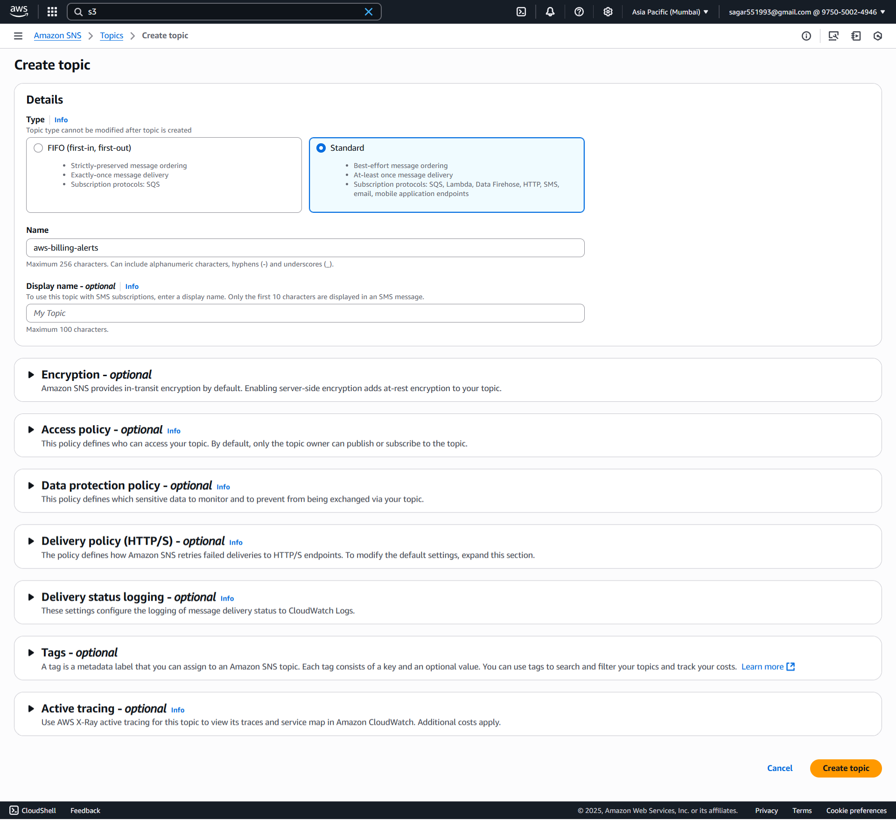
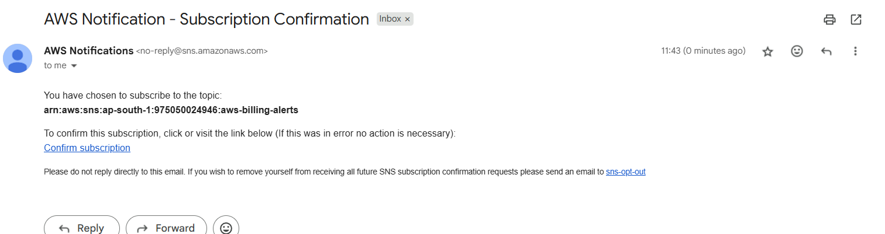
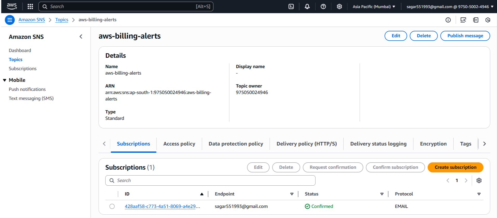
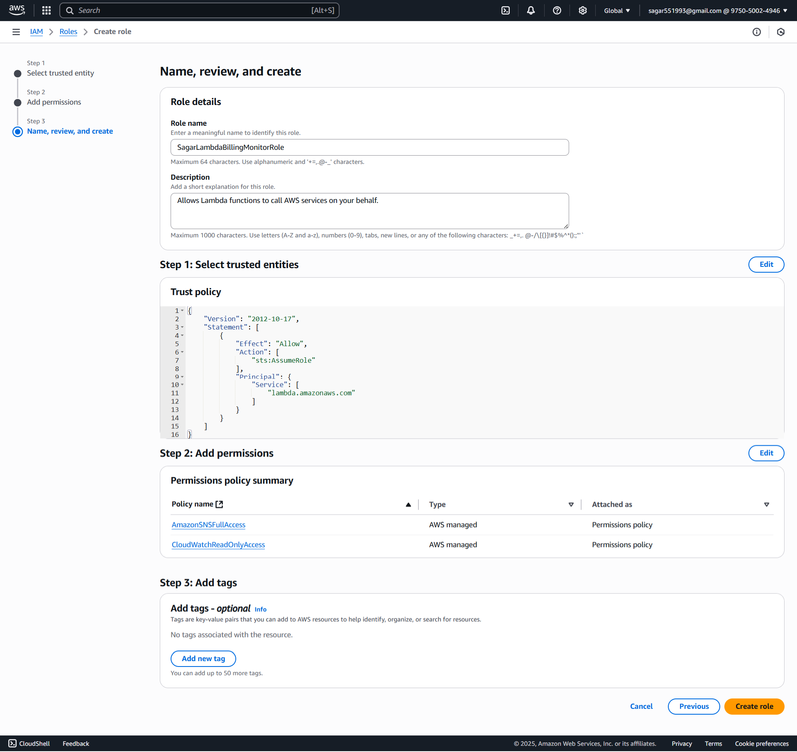
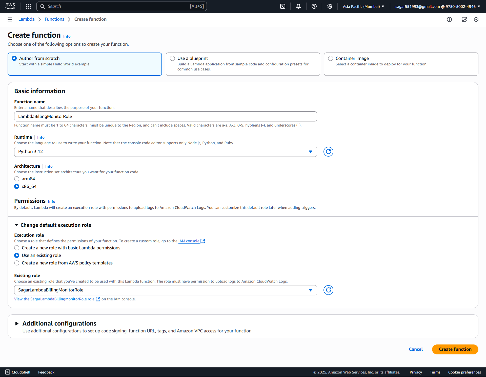
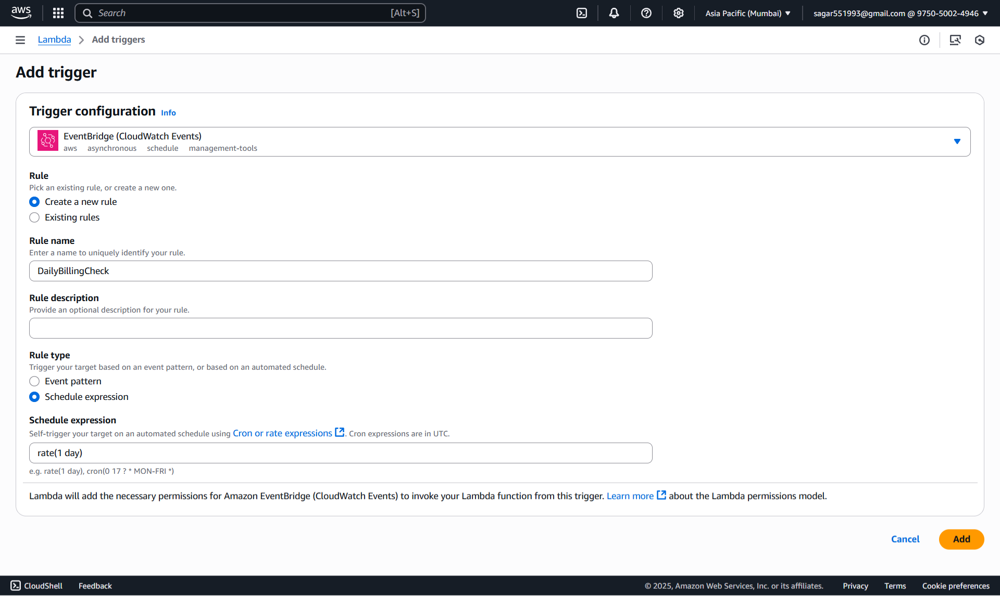
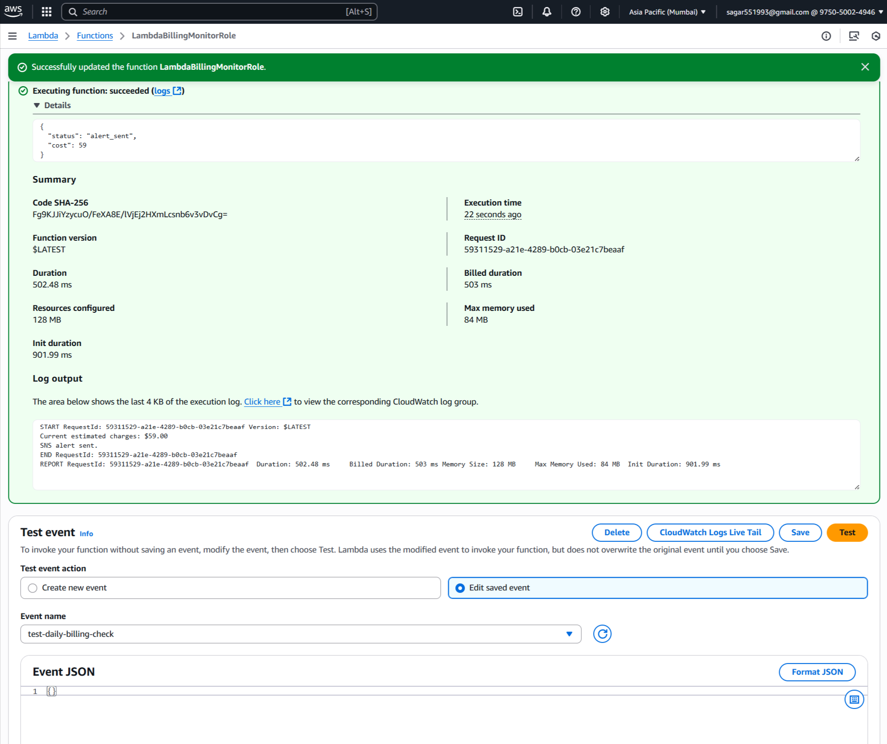
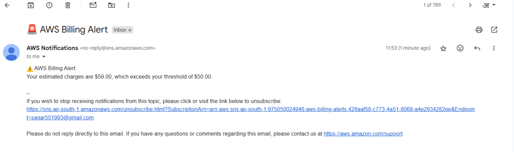

### 🚀 **Assignment 06: Monitor and Alert High AWS Billing Using AWS Lambda, Boto3, and SNS**

#### ✅ Step 1. SNS Setup

##### 📌 1.1. Create an SNS Topic

1. Go to **AWS Management Console** → **SNS** → **Topics**.
2. Click **➕ Create topic**.
3. **Type**: `Standard`
4. **Name**: `aws-billing-alerts`
5. Click **Create topic**


##### 📧 1.2. Subscribe Your Email

1. Select your newly created topic.
2. Click **Create subscription**.
3. **Protocol**: `Email`
4. **Endpoint**: *Your email address*
5. 📩 Check your email inbox and **confirm the subscription** by clicking the link.




#### **🔐 Step 2: Create Lambda IAM Role**

##### 🔑 **2.1 Create an IAM Role**

1. Navigate to the [AWS IAM Console](https://console.aws.amazon.com/iam/).
2. Click **Roles > Create role**.
3. Select **AWS service** and choose **Lambda**.
4. Click **Next**.

#### 🛡️ **2.2 Attach Permissions**

1. Search and select `CloudWatchReadOnlyAccess` (for simplicity) and also select `AmazonSNSFullAccess`.
2. Click **Next**.

#### 📝 **2.3 Finalize Role Creation**

1. Name the role, e.g., `SagarLambdaBillingMonitorRole`.
2. Click **Create role**.


#### ⚡ **Step 3: Create Lambda Function**

##### 3.1 🏃‍♂️ Go to Lambda Console

1. In AWS Console, 🔎 search for and select **Lambda**.
2. Click **Create function**

##### 3.2 ⚙️ Configure Function

1. **Author from scratch**

   * 📝 Name: `LambdaBillingMonitorRole`
   * 🐍 Runtime: **Python 3.12**
2. **Change default execution role:**

   * Select **Use an existing role**
   * Choose the `SagarLambdaBillingMonitorRole` you just created
3. ✅ Click **Create function**


##### 3.3 Lambda Python Script

For best practice, set this as an **environment variable** in the Lambda console.

```python
import boto3
import os
from datetime import datetime, timedelta

# Set your billing threshold and SNS topic ARN
BILLING_THRESHOLD = float(os.environ.get("BILLING_THRESHOLD", "50.0"))
SNS_TOPIC_ARN = os.environ.get("SNS_TOPIC_ARN")

cloudwatch = boto3.client('cloudwatch', region_name='ap-south-1')
sns = boto3.client('sns')

def lambda_handler(event, context):
    try:
        response = cloudwatch.get_metric_statistics(
            Namespace='AWS/Billing',
            MetricName='EstimatedCharges',
            Dimensions=[{'Name': 'Currency', 'Value': 'USD'}],
            StartTime=datetime.utcnow() - timedelta(days=1),
            EndTime=datetime.utcnow(),
            Period=86400,
            Statistics=['Maximum']
        )

        datapoints = response['Datapoints']
        if not datapoints:
            print("No billing data available yet.")
            return

        latest_point = sorted(datapoints, key=lambda x: x['Timestamp'])[-1]
        cost = latest_point['Maximum']

        print(f"Current estimated charges: ${cost:.2f}")

        if cost > BILLING_THRESHOLD:
            message = f"⚠️ AWS Billing Alert:\nYour estimated charges are ${cost:.2f}, which exceeds your threshold of ${BILLING_THRESHOLD:.2f}."
            sns.publish(
                TopicArn=SNS_TOPIC_ARN,
                Subject="🚨 AWS Billing Alert",
                Message=message
            )
            print("SNS alert sent.")
        else:
            print("Billing is within the threshold.")

    except Exception as e:
        print(f"Error: {str(e)}")
```

Click **Deploy**.

##### 🛠️ **3.4 Configure Environment Variables**

1. Click on the **Configuration** tab in Lambda.
2. Go to **Environment variables** and add:
   * `BILLING_THRESHOLD`: e.g., `50`
   * `SNS_TOPIC_ARN`: e.g., `arn:aws-xxxxx`
3. Click **Save**.

#### **⏰ Step 4 Schedule Lambda with CloudWatch Events**

1. Go to your Lambda function.
2. Click **Add trigger** > **EventBridge (CloudWatch Events)**.
3. Name: `DailyBillingCheck`
3. Set the schedule expression (e.g., `rate(1 day)` (daily at 12 PM UTC)).
4. Click **Add**.


#### **🧪 Step 5: Manual Test & Automation & Validation**
##### 5.1 🧑‍🔬 Test in Lambda Console

1. In your Lambda function page, click **Test**.
2. For the first time, it asks to "Configure test event":

   * 📝 **Event name:** (`test-daily-billing-check`)
   - Leave the event JSON as `{}` (empty event)
   * Click **Save**
3. 🟢 Click **Test** (again) to **run** the function.
4. Check your email for the SNS alert.



##### 5.2 Automation
- A daily email is sent with your subscription details automatically.

##### 5.3 🔍 Validation


#### ✅ Notes:
- Billing metrics are only available in ap-south-1 region
- Ensure your account has billing enabled for CloudWatch:
    - [Enable Billing Alerts](https://console.aws.amazon.com/billing/home?#/preferences)