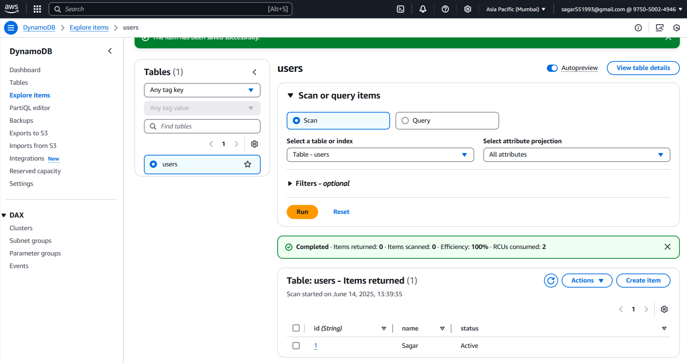
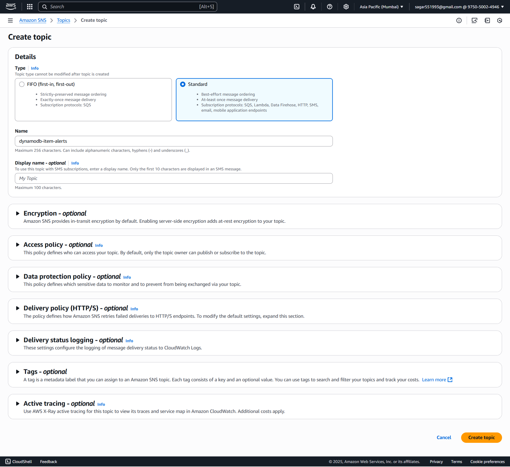
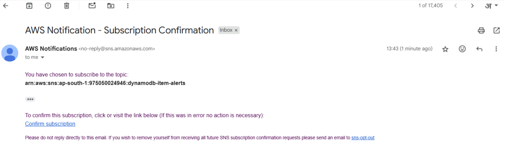
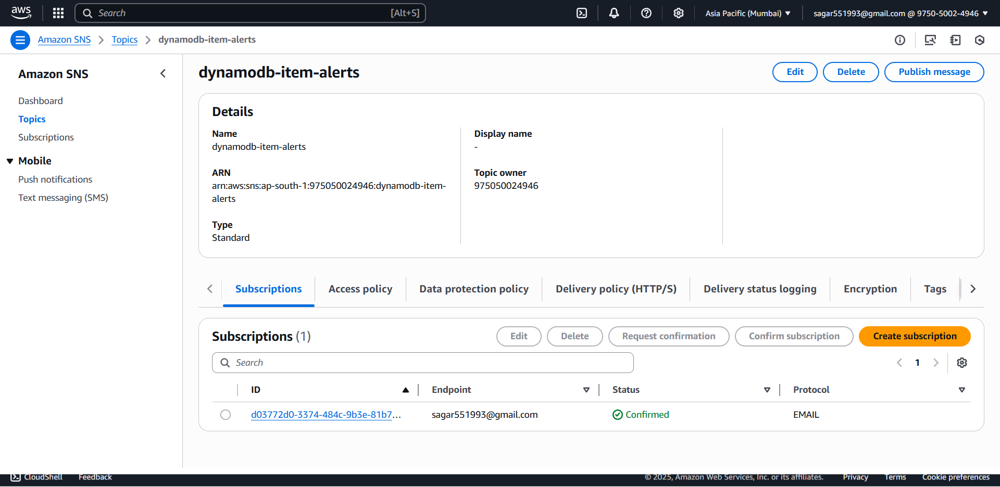
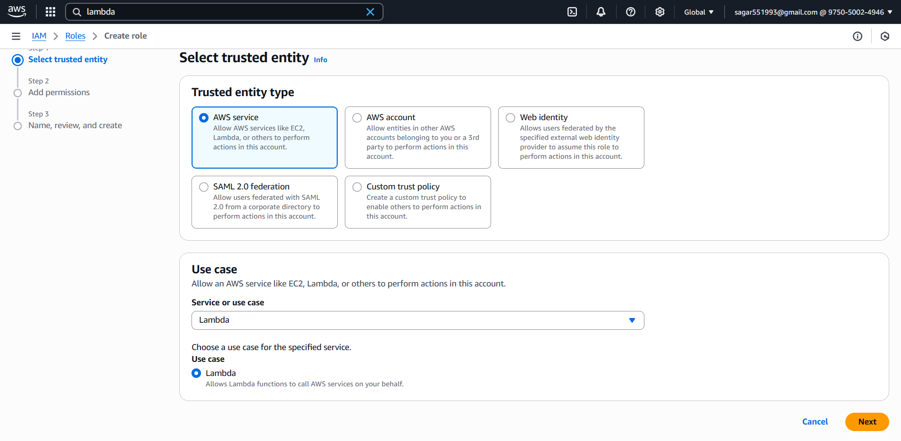
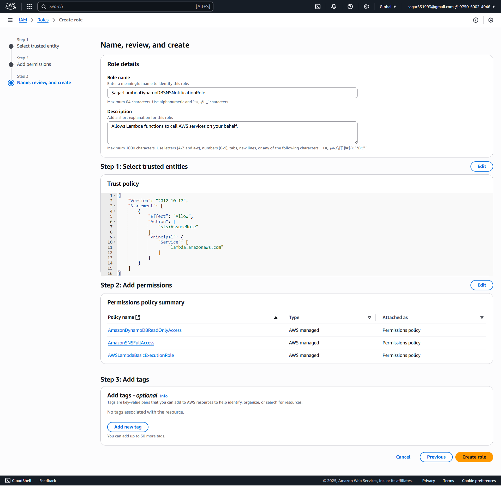
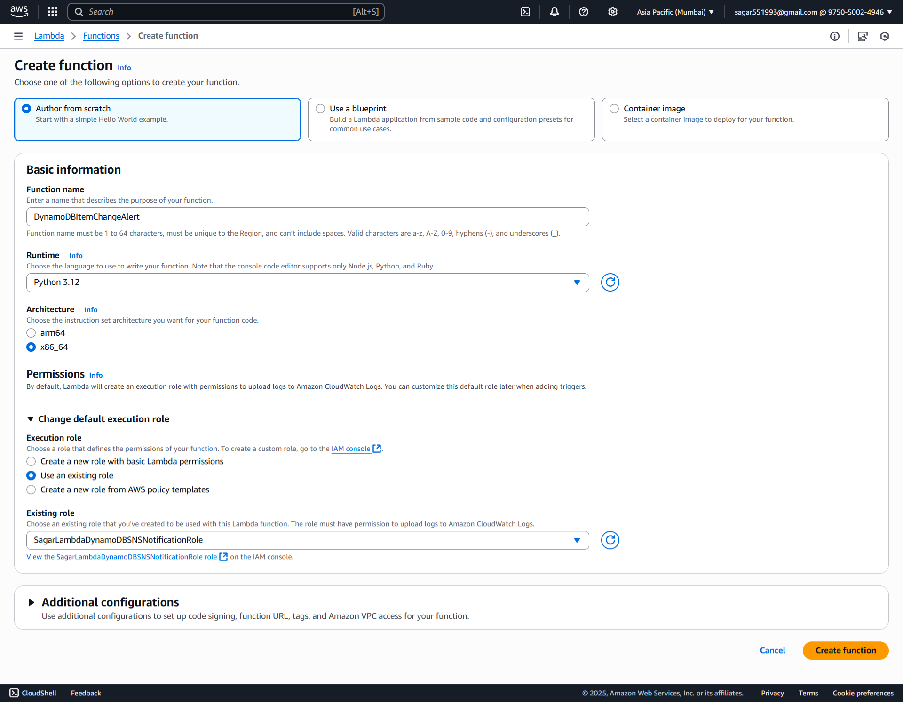
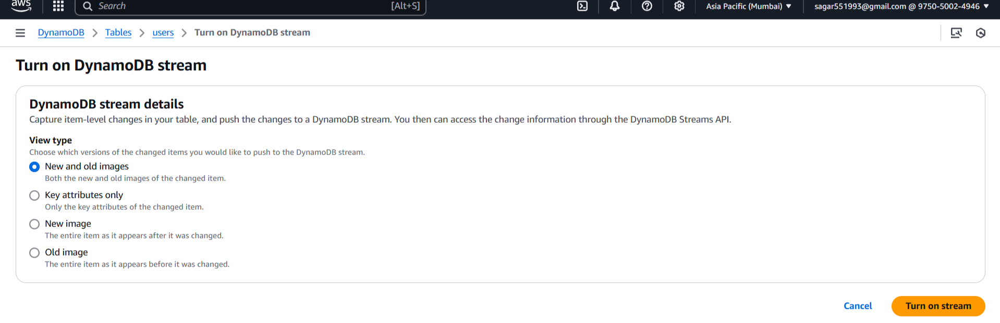
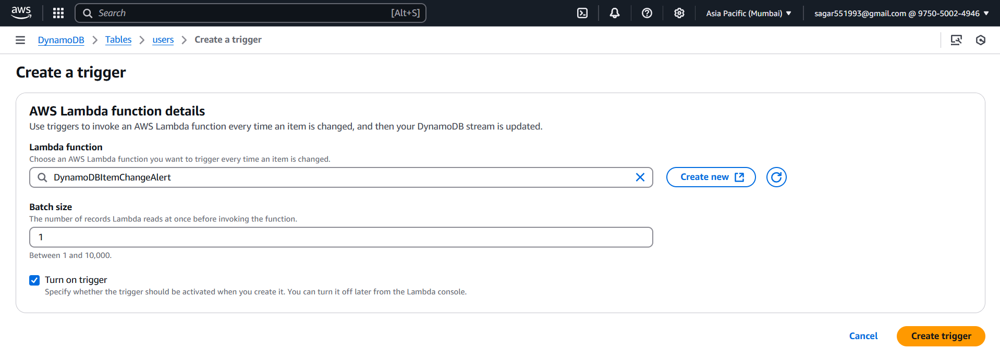
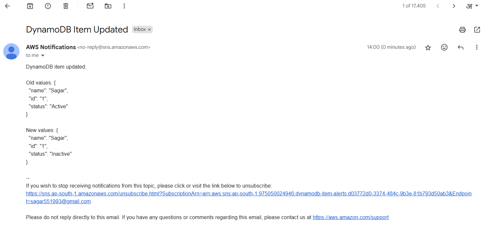

### 🚀 **Assignment 07: DynamoDB Item Change Alert Using AWS Lambda, Boto3, and SNS**


#### 🗄️1. DynamoDB Setup

##### 🗃️ 1.1. Create a DynamoDB Table

1. Go to **AWS Console** → **DynamoDB** → **Tables**.

2. Click **Create table**.

3. Enter:

   * **Table name**: `users`
   * **Primary key**:
     Example:

     * Name: `id`
     * Type: `String`

4. Leave other settings as default and click **Create table**.

##### ➕ 1.2. Add Items
1. Open your table.
2. Click **Explore table items** → **Create item**.
3. Add a few items.
Example JSON:
```json
{
    "id": { "S": "1" },
    "name": { "S": "Sagar" },
    "status": { "S": "Active" }
}
```


#### ✅ Step 2. SNS Setup

##### 📌 2.1. Create an SNS Topic

1. Go to **AWS Management Console** → **SNS** → **Topics**.
2. Click **➕ Create topic**.
3. **Type**: `Standard`
4. **Name**: `dynamodb-item-alerts`
5. Click **Create topic**


##### 📧 2.2. Subscribe Your Email

1. Select your newly created topic.
2. Click **Create subscription**.
3. **Protocol**: `Email`
4. **Endpoint**: *Your email address*
5. 📩 Check your email inbox and **confirm the subscription** by clicking the link.



#### **🔐 Step 3: Create Lambda IAM Role**

##### 🔑 **3.1 Create an IAM Role**

1. Navigate to the [AWS IAM Console](https://console.aws.amazon.com/iam/).
2. Click **Roles > Create role**.
3. Select **AWS service** and choose **Lambda**.
4. Click **Next**.

#### 🛡️ **3.2 Attach Permissions**

1. Attach policies
    - `AWSLambdaBasicExecutionRole`
    - `AmazonDynamoDBReadOnlyAccess`
    - `AmazonSNSFullAccess`
    - `AmazonDynamoDBFullAccess`
2. Click **Next**.

#### 📝 **3.3 Finalize Role Creation**

1. Name the role, e.g., `SagarLambdaDynamoDBSNSNotificationRole`.
2. Click **Create role**.


#### ⚡ **Step 4: Create Lambda Function**

##### 4.1 🏃‍♂️ Go to Lambda Console

1. In AWS Console, 🔎 search for and select **Lambda**.
2. Click **Create function**

##### 4.2 ⚙️ Configure Function

1. **Author from scratch**

   * 📝 Name: `DynamoDBItemChangeAlert`
   * 🐍 Runtime: **Python 3.12**
2. **Change default execution role:**

   * Select **Use an existing role**
   * Choose the `SagarLambdaDynamoDBSNSNotificationRole` you just created
3. ✅ Click **Create function**


##### 4.3 Lambda Python Script

For best practice, set this as an **environment variable** in the Lambda console.

```python
import boto3
import os
import json

SNS_TOPIC_ARN = os.environ.get('SNS_TOPIC_ARN')
sns = boto3.client('sns')

def lambda_handler(event, context):
    for record in event.get('Records', []):
        if record['eventName'] == 'MODIFY':
            old_image = record['dynamodb'].get('OldImage', {})
            new_image = record['dynamodb'].get('NewImage', {})
            
            # Convert DynamoDB types to JSON
            def ddb_to_dict(image):
                return {k: list(v.values())[0] for k, v in image.items()}
            
            old = ddb_to_dict(old_image)
            new = ddb_to_dict(new_image)

            message = (
                f"DynamoDB item updated:\n\n"
                f"Old values: {json.dumps(old, indent=2)}\n\n"
                f"New values: {json.dumps(new, indent=2)}"
            )

            # Publish to SNS
            sns.publish(
                TopicArn=SNS_TOPIC_ARN,
                Subject="DynamoDB Item Updated",
                Message=message
            )

            print(f"Alert sent:\n{message}")
    return {"status": "done"}
```

Click **Deploy**.

##### 🛠️ **4.4 Configure Environment Variables**

1. Click on the **Configuration** tab in Lambda.
2. Go to **Environment variables** and add:
   * `SNS_TOPIC_ARN`: e.g., `arn:aws-xxxxx`
3. Click **Save**.

#### 🔄 5. DynamoDB Stream Setup
##### 🌀 5.1. Enable Streams
 1. Go to your **DynamoDB table**.
 2. Click **Exports and streams** tab.
 3. Under **DynamoDB stream details**, click **Enable**.
 4. Set *View type*: New and old images
 5. Click **Enable** stream


##### ⚡5.2. Attach Lambda Trigger
 1. On the same page, click **Manage 
Stream Lambda triggers**.
 2. Click **Create trigger**.
 3. Select your Lambda function (`DynamoDBItemChangeAlert`).
 4. Click **Create**.


#### 🧪 6. Testing
1. Go to your **DynamoDB table → Explore table items**.
2. Update any item (e.g., change `"status": "Active"` to `"status": "Inactive"`).
3. Wait a few seconds. Check your email inbox (and spam folder).
4. You’ll receive an email from SNS with details of the item change.

