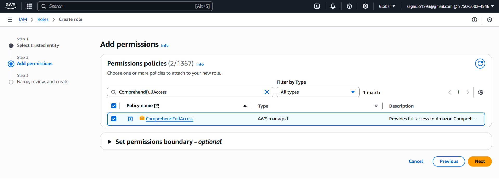
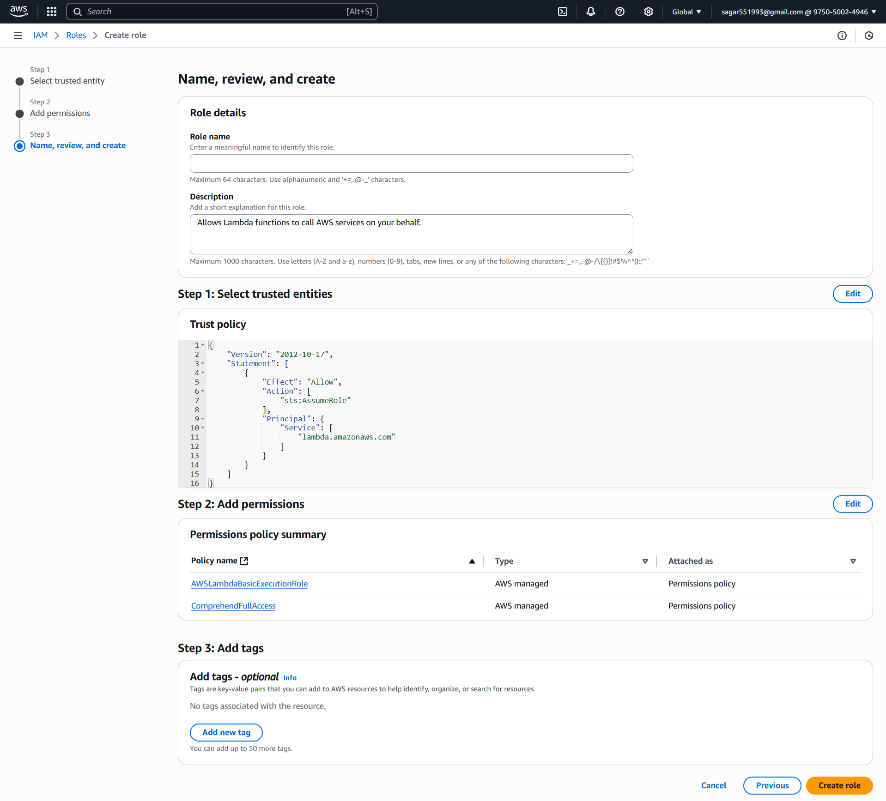
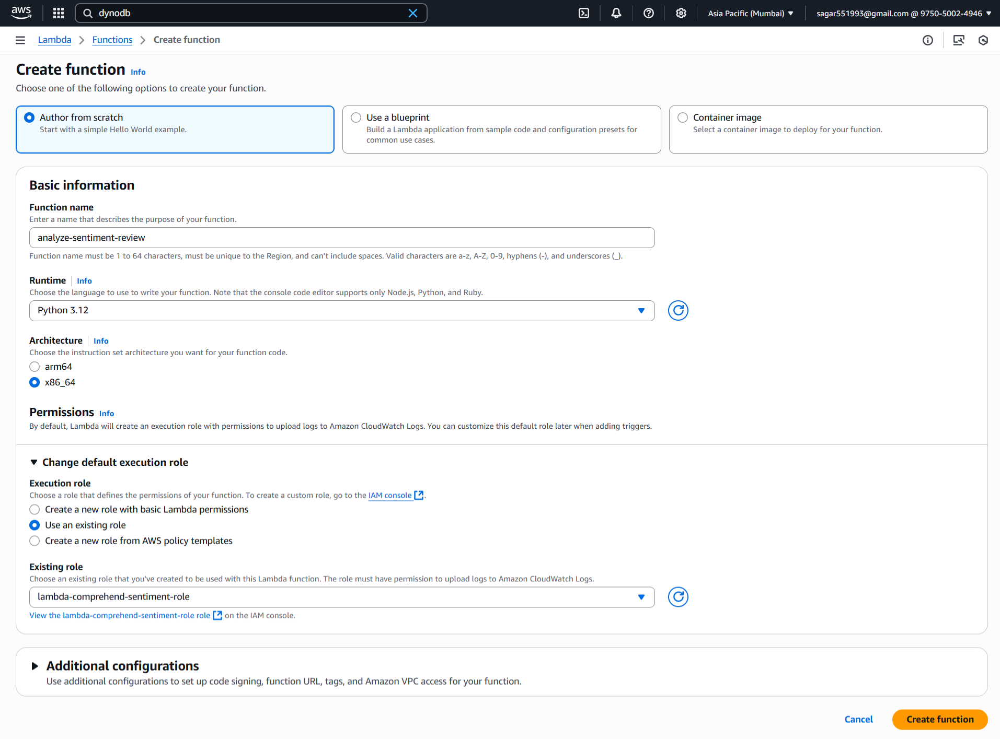
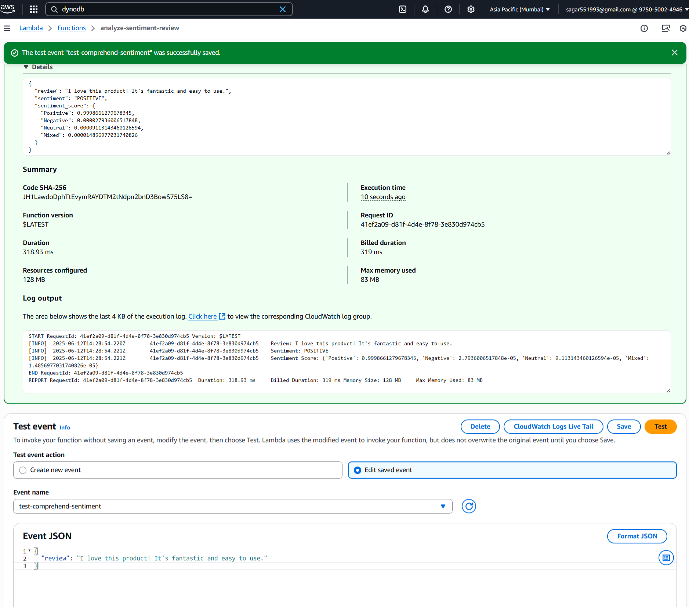
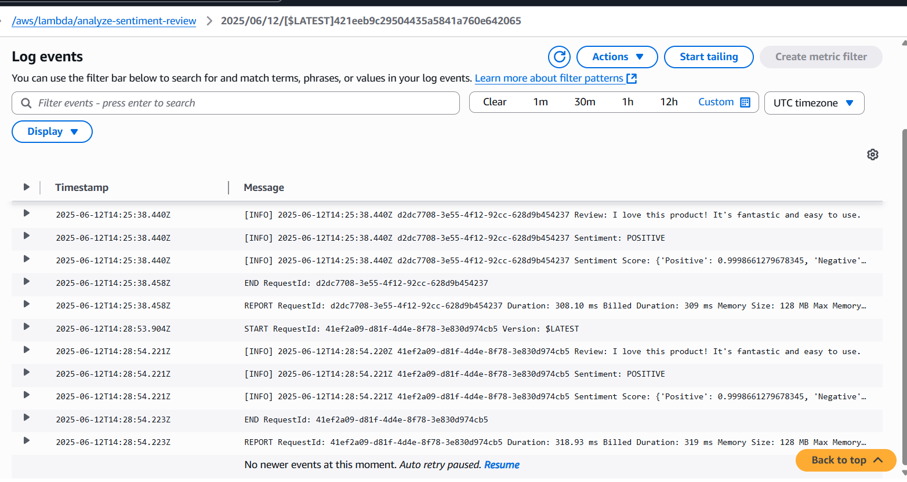

### 🚀 **Assignment 08: Analyze Sentiment of User Reviews Using AWS Lambda, Boto3, and Amazon Comprehend**

#### **🔐 Step 1: Create Lambda IAM Role**

##### 🔑 **1.1 Create an IAM Role**

1. Navigate to the [AWS IAM Console](https://console.aws.amazon.com/iam/).
2. Click **Roles > Create role**.
3. Select **AWS service** and choose **Lambda**.
4. Click **Next**.

#### 🛡️ **1.2 Attach Permissions**

1. Search and select `ComprehendFullAccess` (for simplicity) & also select `AWSLambdaBasicExecutionRole`.
2. Click **Next**.

#### 📝 **1.3 Finalize Role Creation**

1. Name the role, e.g., `lambda-comprehend-sentiment-role`.
2. Click **Create role**.


#### ⚡ **Step 2: Create Lambda Function**

##### 2.1 🏃‍♂️ Go to Lambda Console

1. In AWS Console, 🔎 search for and select **Lambda**.
2. Click **Create function**

##### 2.2 ⚙️ Configure Function

1. **Author from scratch**

   * 📝 Name: `analyze-sentiment-review`
   * 🐍 Runtime: **Python 3.12**
2. **Change default execution role:**

   * Select **Use an existing role**
   * Choose the `lambda-comprehend-sentiment-role` you just created
3. ✅ Click **Create function**


##### 2.3 Lambda Python Script

For best practice, set this as an **environment variable** in the Lambda console.

```python
import boto3
import logging

logger = logging.getLogger()
logger.setLevel(logging.INFO)

comprehend = boto3.client('comprehend')

def lambda_handler(event, context):
    # 1. Extract the review text from the event
    review_text = event.get('review', '')
    if not review_text:
        logger.error("No review found in the event payload.")
        return {"error": "No review provided."}
    
    # 2. Analyze sentiment using Comprehend
    response = comprehend.detect_sentiment(
        Text=review_text,
        LanguageCode='en'  # Change if working with another language
    )
    
    sentiment = response['Sentiment']
    sentiment_score = response['SentimentScore']
    
    # 3. Log the sentiment result
    logger.info(f"Review: {review_text}")
    logger.info(f"Sentiment: {sentiment}")
    logger.info(f"Sentiment Score: {sentiment_score}")
    
    return {
        "review": review_text,
        "sentiment": sentiment,
        "sentiment_score": sentiment_score
    }
```

#### **🧪 Step 3: Manual Test & Validation**
##### 3.1 🧑‍🔬 Test in Lambda Console

1. In your Lambda function page, click **Test**.
2. For the first time, it asks to "Configure test event":

   * 📝 **Event name:** (`test-comprehend-sentiment`)
   * **Event JSON** 
   ```{"review": "I love this product! It's antastic and easy to use." }```
   * Click **Save**
3. 🟢 Click **Test** (again) to **run** the function.

##### 3.2 🔍 Logs
