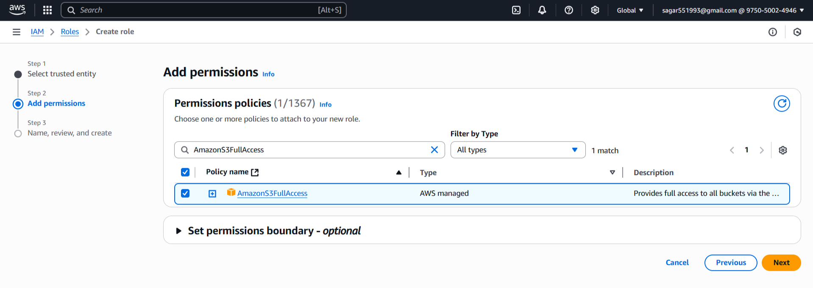
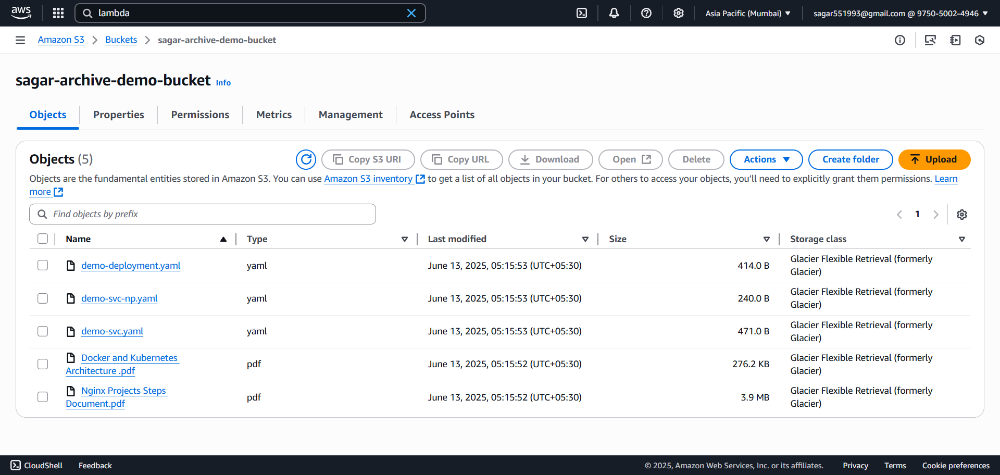

### 🚀 **Assignment 9: Archive Old Files from S3 to Glacier Using AWS Lambda and Boto3**

#### 🗂️ **Step 1: Setting Up Your S3 Bucket**

#### 🪣 **1.1 Create Your Bucket**

1. Log into the [AWS S3 Console](https://console.aws.amazon.com/s3/).
2. Click **Create bucket**.
3. Provide a globally unique bucket name (e.g., `sagar-s3-cleanup-bucket`).
4. Choose your preferred region.
5. Click **Create bucket**.

#### 📤 **1.2 Uploading Files**

1. Select your bucket.
2. Click **Upload** and add files (images, texts, etc.).
3. Complete the upload.

#### **🔐 Step 2: Create Lambda IAM Role**

##### 🔑 **2.1 Create an IAM Role**

1. Navigate to the [AWS IAM Console](https://console.aws.amazon.com/iam/).
2. Click **Roles > Create role**.
3. Select **AWS service** and choose **Lambda**.
4. Click **Next**.

#### 🛡️ **2.2 Attach Permissions**

1. Search and select `AmazonS3FullAccess` (for simplicity).
2. Click **Next**.

#### 📝 **2.3 Finalize Role Creation**

1. Name the role, e.g., `sagar-lambda-s3-glacier-role`.
2. Click **Create role**.


#### ⚡ **Step 3: Create Lambda Function**

##### 3.1 🏃‍♂️ Go to Lambda Console

1. In AWS Console, 🔎 search for and select **Lambda**.
2. Click **Create function**

##### 3.2 ⚙️ Configure Function

1. **Author from scratch**

   * 📝 Name: `archive-s3-objects-to-glacier`
   * 🐍 Runtime: **Python 3.12**
2. **Change default execution role:**

   * Select **Use an existing role**
   * Choose the `sagar-lambda-s3-glacier-role` you just created
3. ✅ Click **Create function**


##### 3.3 Lambda Python Script

For best practice, set this as an **environment variable** in the Lambda console.

```python
import boto3
from datetime import datetime, timezone, timedelta
import os

BUCKET_NAME = os.environ.get('BUCKET_NAME', 'sagar-archive-demo-bucket')
AGE_DAYS = int(os.environ.get('AGE_DAY', 160)) # 6 months ≈ 180 days
GLACIER_CLASS = os.environ.get('GLACIER_CLASS', 'GLACIER')

def lambda_handler(event, context):
    s3 = boto3.client('s3')
    now = datetime.now(timezone.utc)
    cutoff_date = now - timedelta(days=AGE_DAYS)
    archived = []

    paginator = s3.get_paginator('list_objects_v2')
    for page in paginator.paginate(Bucket=BUCKET_NAME):
        for obj in page.get('Contents', []):
            key = obj['Key']
            last_modified = obj['LastModified']
            storage_class = obj.get('StorageClass', 'STANDARD')

            # If object is older than cutoff and not already Glacier
            if last_modified < cutoff_date and storage_class not in ['GLACIER', 'DEEP_ARCHIVE']:
                s3.copy_object(
                    Bucket=BUCKET_NAME,
                    Key=key,
                    CopySource={'Bucket': BUCKET_NAME, 'Key': key},
                    StorageClass=GLACIER_CLASS,
                    MetadataDirective='COPY'
                )
                archived.append(key)

    return {'archived_files': archived}
```

Click **Deploy**.

##### 🛠️ **3.4 Configure Environment Variables**

1. Click on the **Configuration** tab in Lambda.
2. Go to **Environment variables** and add:

   * `AGE_DAY`: e.g., `180`
   * `BUCKET_NAME`: e.g., `sagar-archive-demo-bucket`
   * `GLACIER_CLASS`: e.g., `GLACIER`

Click **Save**.

#### **⏰ Step 4 Schedule Lambda with CloudWatch Events**

1. Go to your Lambda function.
2. Click **Add trigger** > **EventBridge (CloudWatch Events)**.
3. Set the schedule expression (e.g., `rate(1 day)`).
4. Click **Add**.


#### **🧪 Step 5: Manual Test & Validation**
##### 5.1 🧑‍🔬 Test in Lambda Console

1. In your Lambda function page, click **Test**.
2. For the first time, it asks to "Configure test event":

   * 📝 **Event name:** (`test-glacier-class`)
   - Leave the event JSON as `{}` (empty event)
   * Click **Save**
3. 🟢 Click **Test** (again) to **run** the function.

##### 5.2 🔍 Validation
